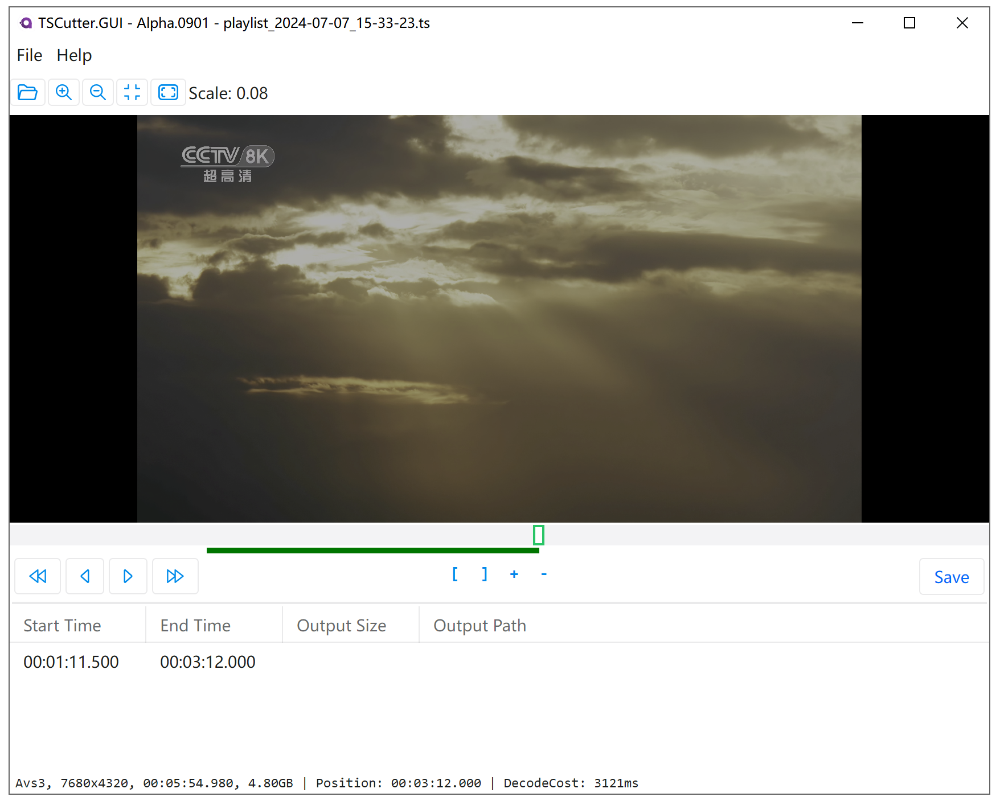

# TSCutter.GUI
English | [中文版](./README_CN.md)

TSCutter.GUI is a lightweight tool designed to efficiently cut TS (Transport Stream) video files. It allows users to quickly navigate through keyframes and extract specific segments without modifying the original data.

> The software is still under development and has not been officially released, so it may contain **MANY BUGS**.  

## Features
- **Keyframe Navigation**: Jump to the next, previous, or any specific keyframe.
- **Keyframe-level precise cutting**: Extract video segments based on keyframes, ensuring no data loss or modification.
- **Multi-Platform Support**: Available for Windows, Linux, and macOS.
- **High Performance**: Leveraging direct binary data copying for maximum efficiency.

## FFmpeg Runtime
Official release packages bundle the required **FFmpeg 7.1.3** shared libraries. End users do not need to install FFmpeg manually anymore.

Bundled runtime source: [nilaoda/FFmpegSharedLibraries](https://github.com/nilaoda/FFmpegSharedLibraries/releases/latest). The Windows x64, Linux x64, and macOS arm64 FFmpeg shared libraries used by TSCutter.GUI releases are all maintained in that repository.

The macOS arm64 release archive now extracts to `TSCutter.GUI.app`, so users can launch the app directly after unzipping.

If macOS blocks the app with a quarantine warning, run:
```bash
xattr -dr com.apple.quarantine TSCutter.GUI.app
```

If you are building or running the app from source without those bundled runtimes, you still need a compatible FFmpeg 7 installation.

### Linux source builds
Installing FFmpeg on Linux depends on the distribution you are using.

On Ubuntu 22.04:
```bash
sudo add-apt-repository ppa:ubuntuhandbook1/ffmpeg7
sudo apt update
sudo apt install ffmpeg
```

### macOS source builds
```bash
brew install ffmpeg@7
```

The app first looks for bundled dylibs in the release package. If they are not present, it will automatically probe common Homebrew locations such as `/opt/homebrew/opt/ffmpeg@7/lib` and `/usr/local/opt/ffmpeg@7/lib`.

If your FFmpeg 7 installation lives somewhere else, you can set `FFmpegRootPath` in `~/Library/Application Support/TSCutter.GUI/config.json` to either the FFmpeg root directory or its `lib` directory.

## Screen


## Usage

1. Launch the application.
2. Load a TS file, or Drop.
3. Use the keyframe navigation buttons to find your desired start and end points.
4. Click "Save" to extract the selected segment.

## Thanks
This project is inspired by an excellent editing software called [VidePub](https://sourceforge.net/projects/videpub/).

## License
This project is licensed under the GPL-3.0 License.
