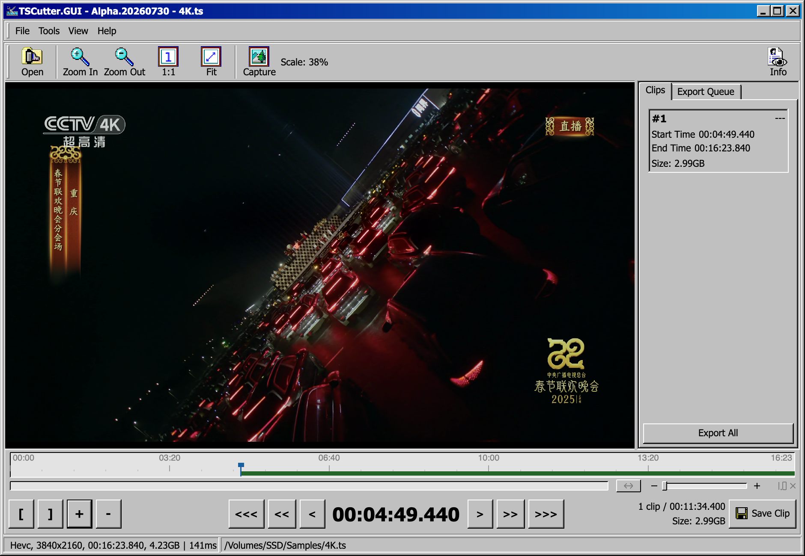

  
  <h1>TSCutter.GUI</h1>
  
<strong>English</strong> | <a href="README_CN.md">中文版</a>

TSCutter.GUI is a cross-platform MPEG-TS editing and diagnostic toolkit. It combines fast keyframe-based cutting with stream inspection, extraction, filtering, structural editing, repair, merging, and packet analysis tools, without transcoding the original audio or video.

> The software is still under development and has not been officially released, so it may contain **MANY BUGS**.  

## Features

### Editing workflow

- **Keyframe-accurate cutting**: Preview and navigate nearby keyframes or jump to a specific time before marking clip boundaries.
- **Zoomable timeline**: Continuously zoom, pan, or return to a full-file overview for accurate navigation in long recordings.
- **Multiple clip management**: Create and edit several clip ranges, view their positions on the timeline, and compare duration and estimated size.
- **Flexible output**: Save one clip immediately, add clips to a batch export queue, or merge multiple selected clips into one TS file.
- **Lossless media copy**: Preserve the original encoded audio and video without transcoding.
- **Frame capture and media information**: Save or copy the current preview frame and inspect the opened file's stream information.

### TS tools

- **TS Raw Stream Cutter**: Extract a byte or packet range directly from a TS file.
- **TS Quick Check**: Scan for synchronization loss, TEI/continuity/PES errors, PCR/PTS/DTS issues, A/V drift, bitrate changes, and export a text report.
- **TS Packet Viewer**: Inspect individual 188-byte packets, navigate by packet number, offset, or PID, and link parsed fields to highlighted Hex bytes.
- **TS Elementary Stream Extractor**: Select one or more tracks and export their raw video, audio, subtitle, or data payload after removing TS and PES encapsulation.
- **TS Stream Filter**: Keep selected PIDs or split selected services while rebuilding the required program and service tables.
- **TS Stream Editor**: Remove tracks or services, remap identifiers and PIDs, and edit service or language metadata while preserving the original encoded media.
- **TS Timeline Repair**: Analyze and safely correct supported PCR and timestamp discontinuities without hiding transport or packet-loss errors.
- **TS Multi-source Repair**: Compare compatible recordings of the same feed and time period, then use healthy packet, PES, or elementary-stream data to repair damaged regions and long gaps where safe.
- **TS Binary Merge**: Directly append ordered TS segments, or detect and remove byte-identical overlap between adjacent files before merging.

### General

- **Multi-platform support**: Available for Windows, Linux, and macOS.
- **Multilingual interface**: English, Simplified Chinese, and Traditional Chinese.
- **Light and dark themes**: Theme-aware classic desktop interface.
- **Independent tool windows**: Open multiple tools or scans at the same time for comparison.
- **Bounded resource usage**: Large-file tools use streaming or on-demand reads instead of loading complete media files into memory.

## FFmpeg Runtime
Official release packages bundle the required **FFmpeg 7.1.3** shared libraries. End users do not need to install FFmpeg manually.

Bundled runtime source: [nilaoda/FFmpegSharedLibraries](https://github.com/nilaoda/FFmpegSharedLibraries/releases/latest).

> **macOS**: If the app is blocked by quarantine, run `xattr -dr com.apple.quarantine TSCutter.GUI.app`.

Building from source

If you are building from source without the bundled runtimes, a compatible FFmpeg 7 installation is required.

- **macOS**: `brew install ffmpeg@7`
- **Linux (Ubuntu 22.04)**: `sudo add-apt-repository ppa:ubuntuhandbook1/ffmpeg7 && sudo apt update && sudo apt install ffmpeg`

On macOS, the app automatically probes common Homebrew locations. If your FFmpeg 7 lives elsewhere, set `FFmpegRootPath` in `~/Library/Application Support/TSCutter.GUI/config.json` to the FFmpeg root directory or its `lib` directory.

## Preview

<picture>
  <source media="(prefers-color-scheme: dark)" srcset="img/dark_en.png">
  <source media="(prefers-color-scheme: light)" srcset="img/light_en.png">
  
</picture>

## Usage

### Main editor

1. Launch the application.
2. Open a TS file or drag it into the main window.
3. Navigate or zoom the timeline, add a clip, and mark its start and end points.
4. Save the current clip, add it to the export queue, or select multiple clips and merge them.

### Independent TS tools

Open any utility directly from the **Tools** menu. Each tool opens in its own window and prompts for the required source file or files; no file needs to be loaded in the main editor first.

## Documentation

Design notes for the TS tools are available in [docs](docs/README.md).

## Thanks
This project is inspired by an excellent editing software called [VidePub](https://sourceforge.net/projects/videpub/).

## License
This project is licensed under the GPL-3.0 License.
