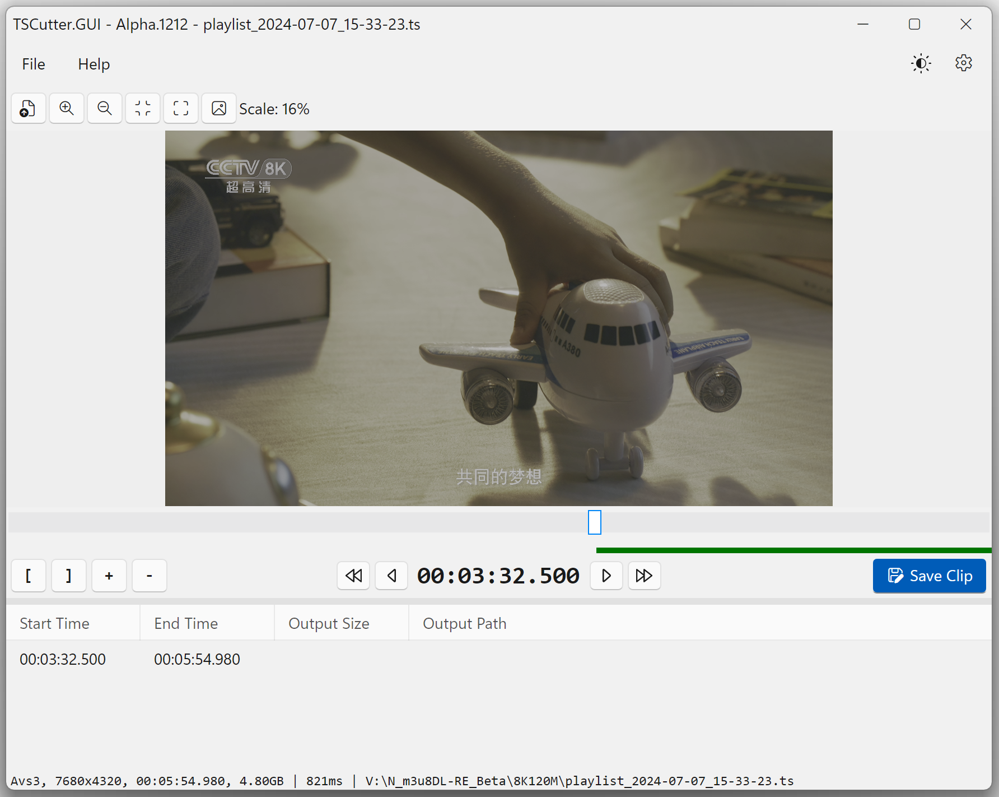

# TSCutter.GUI
TSCutter.GUI is a lightweight tool designed to efficiently cut TS (Transport Stream) video files. It allows users to quickly navigate through keyframes and extract specific segments without modifying the original data.

> The software is still under development and has not been officially released, so it may contain **MANY BUGS**.  

## Features
- **Keyframe Navigation**: Jump to the next, previous, or any specific keyframe.
- **Keyframe-level precise cutting**: Extract video segments based on keyframes, ensuring no data loss or modification.
- **Multi-Platform Support**: Available for Windows, Linux, and macOS.
- **High Performance**: Leveraging direct binary data copying for maximum efficiency.

## Prerequisites
This software depends on the dynamic libraries of FFmpeg.
### Windows
Run `.exe` directly. Bundled libraries: [Sdcb.FFmpeg.runtime.windows-x64](https://www.nuget.org/packages/Sdcb.FFmpeg.runtime.windows-x64/7.0.0)
### macOS
```bash
brew install ffmpeg
```
### Linux
```plain
sudo apt install ffmpeg         [On Debian, Ubuntu and Mint]
sudo yum install ffmpeg         [On RHEL/CentOS/Fedora and Rocky/AlmaLinux]
sudo emerge -a sys-apps/ffmpeg  [On Gentoo Linux]
sudo apk add ffmpeg             [On Alpine Linux]
sudo pacman -S ffmpeg           [On Arch Linux]
sudo zypper install ffmpeg      [On OpenSUSE]    
sudo pkg install ffmpeg         [On FreeBSD]
```
[ref.](https://www.tecmint.com/install-ffmpeg-in-linux/)

## Screen


## Usage

1. Launch the application.
2. Load a TS file, or Drop.
3. Use the keyframe navigation buttons to find your desired start and end points.
4. Click "Save" to extract the selected segment.

## Thanks
This project is inspired by an excellent editing software called [VidePub](https://sourceforge.net/projects/videpub/).

## License
This project is licensed under the LGPL-3.0 License.