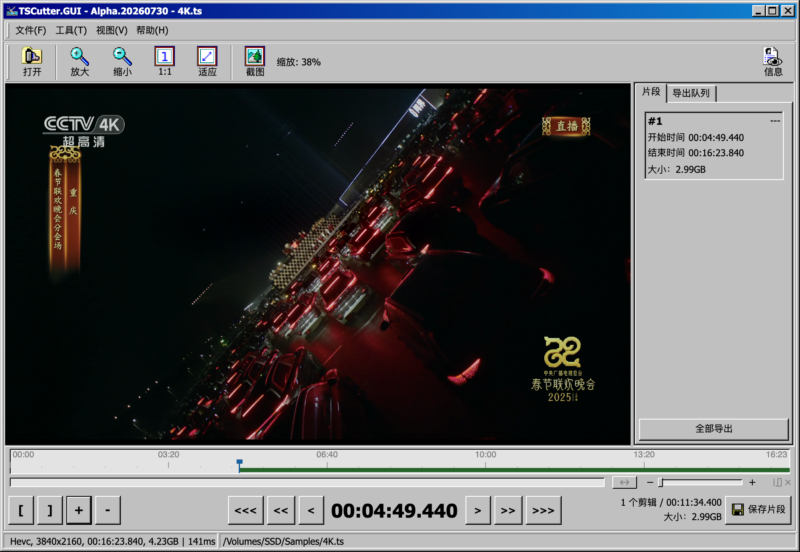

  
  <h1>TSCutter.GUI</h1>
  
<a href="README.md">English</a> | <strong>中文版</strong>

TSCutter.GUI 是一个跨平台 MPEG-TS 剪辑与诊断工具。它在快速关键帧剪辑之外，还提供流检查、过滤、修复、合并和逐包查看能力，并且不会转码原始音视频。

> 该软件仍在开发中，尚未正式发布，因此可能包含 **许多BUG**。

## 功能

### 剪辑流程

- **关键帧级精确剪切**：预览和浏览相邻关键帧，或跳转到指定时间后标记剪辑边界。
- **可缩放时间轴**：支持连续缩放、平移和快速返回总览，方便在长时间录制中精确定位。
- **多剪辑管理**：创建和编辑多个剪辑区间，在时间轴上查看位置，并比较时长和预计大小。
- **灵活输出**：可以立即保存单个剪辑、加入批量导出队列，或将多个选中剪辑合并为一个 TS 文件。
- **无损媒体复制**：保留原始音视频编码，不进行转码。
- **截图与媒体信息**：保存或复制当前预览帧，并查看已打开文件的流信息。

### TS 工具

- **TS 原始流截取**：按字节范围或包范围直接提取 TS 数据。
- **TS 快速检查**：扫描同步丢失、TEI、连续计数器、PES、PCR、PTS、DTS、音视频漂移和码率变化，并可导出文本报告。
- **TS 时间轴修复**：分析并安全校正受支持的 PCR 和时间戳不连续问题，不掩盖传输错误或真实丢包。
- **TS 流过滤器**：保留选定 PID，或按服务拆分文件，同时重建必要的节目表和业务表。
- **TS 多源修复**：比较同一信号源、同一时间段的兼容录制，在安全匹配的前提下使用正常的 TS 包、PES 或 ES 数据修复损坏区域及大段缺失。
- **TS 二进制合并**：按顺序直接追加 TS 分片，或识别相邻文件中二进制完全相同的重叠区域，去重后合并。
- **TS 包查看器**：逐包查看 188 字节 TS 数据，按包编号、偏移或 PID 导航，并将解析字段与 Hex 字节高亮关联。

### 通用能力

- **多平台支持**：支持 Windows、Linux 和 macOS。
- **多语言界面**：支持英文、简体中文和繁体中文。
- **浅色与深色主题**：适配主题的 Classic 桌面界面。
- **独立工具窗口**：可同时打开多个工具或扫描窗口进行对照。
- **有界资源占用**：面向大文件的工具采用流式或按需读取，不会把完整媒体文件加载到内存。

## FFmpeg 运行时
官方发布包已内置 **FFmpeg 7.1.3** 共享库，普通用户无需手动安装。

内置运行时来源：[nilaoda/FFmpegSharedLibraries](https://github.com/nilaoda/FFmpegSharedLibraries/releases/latest)。

> **macOS**：若因隔离属性（quarantine）被拦截，请执行 `xattr -dr com.apple.quarantine TSCutter.GUI.app`。

从源码构建

从源码构建且未内置运行时库时，需自行准备兼容的 FFmpeg 7 环境。

- **macOS**：`brew install ffmpeg@7`
- **Linux (Ubuntu 22.04)**：`sudo add-apt-repository ppa:ubuntuhandbook1/ffmpeg7 && sudo apt update && sudo apt install ffmpeg`

macOS 下程序会自动探测常见的 Homebrew 路径；若 FFmpeg 7 安装在其他位置，可在 `~/Library/Application Support/TSCutter.GUI/config.json` 中设置 `FFmpegRootPath` 为 FFmpeg 根目录或其 `lib` 目录。

## 界面预览

<picture>
  <source media="(prefers-color-scheme: dark)" srcset="img/dark_cn.png">
  <source media="(prefers-color-scheme: light)" srcset="img/light_cn.png">
  
</picture>

## 使用方法

### 主剪辑界面

1. 启动应用程序。
2. 加载 TS 文件，或直接拖入文件。
3. 浏览或缩放时间轴，添加剪辑并标记起点和终点。
4. 保存当前剪辑、加入导出队列，或选择多个剪辑进行合并。

### 独立 TS 工具

可以直接从“工具”菜单打开任意工具。每个工具都会在独立窗口中引导选择所需的一个或多个源文件，无需先在主剪辑界面加载文件。

## 设计文档

TS 工具的设计说明位于 [docs](docs/README.md)。

## 致谢
此项目灵感来自一个出色的DVB视频剪辑软件 [VidePub](https://sourceforge.net/projects/videpub/)。

## 许可证
本项目采用 GPL-3.0 许可证。
