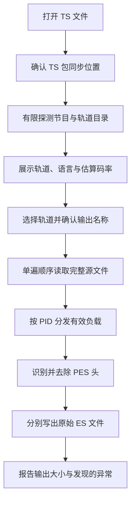

# TS ES 提取器设计方案

## 1. 目标

TS ES 提取器用于从 MPEG-TS 文件中选择一个或多个节目轨道，去除 TS 包和 PES 头，分别
输出对应的原始基本流数据。

主要使用场景包括：

- 提取 H.264、HEVC、MPEG-2 Video 或 AVS 系列视频码流；
- 提取 AAC、MPEG Audio、AC-3、E-AC-3、DTS、AV3A 或 DRA 等音频码流；
- 将单条轨道交给专业分析器检查编码结构；
- 比较不同 TS 文件中同一轨道的原始媒体字节；
- 为后续封装、转码或故障定位准备独立输入。

工具只改变承载形式，不解码、不转码，也不重新编码媒体内容。

## 2. 与其他工具的分工

### 2.1 与 TS 流过滤器的区别

TS 流过滤器输出的仍是 TS 文件。它会保留或重建 PAT、PMT、PCR 和必要业务信息，使所选
节目或轨道继续作为传输流被播放器识别。

TS ES 提取器不保留节目表、PCR、TS 包头或 PES 头。每个选中 PID 独立输出为一个文件，
适合码流分析，不保证能够像完整 TS 一样直接播放。

### 2.2 与 TS 流编辑器的区别

TS 流编辑器用于修改单个 TS 的节目结构、PID、语言和服务信息，并输出结构自洽的新 TS。
ES 提取器不修改这些信息，也不重新封装输出。

### 2.3 与快速检查的区别

快速检查负责发现整份 TS 中的连续性、封装和时间戳异常。ES 提取器只在输出过程中进行
必要的局部结构判断，以避免把已知不可靠的负载继续拼入结果；它不替代完整质量检查。

## 3. 范围与非目标

### 3.1 当前范围

- 标准 188 字节 MPEG-TS；
- 从 PAT、PMT、SDT 和描述符建立节目与轨道目录；
- 展示 PID、节目、编码、语言和估算码率；
- 同时选择并输出多个基本流；
- 去除 TS 与 PES 封装；
- 根据已识别的编码建议输出扩展名；
- 对传输错误、连续性异常、重复包、加扰负载和同步丢失采取保守处理；
- 顺序读取、有界内存和可取消输出。

### 3.2 非目标

- 不生成新的 TS、PS、MP4、MKV 或其他容器；
- 不保留 PCR、PTS、DTS 等容器与 PES 时间信息；
- 不转码、重采样或改变编码参数；
- 不修复源文件中已经丢失的媒体内容；
- 不解析或重写完整的音视频帧结构；
- 不保证未知私有流具有通用扩展名；
- 不处理加密或加扰后的媒体负载。

## 4. 总体流程

准备阶段只读取建立轨道目录所需的有限范围。用户开始提取后才顺序读取完整源文件。

## 5. 轨道探测

### 5.1 节目与轨道目录

可提取轨道主要来自 PMT 中声明的基本流。目录会结合以下信息：

- PAT 中的节目与 PMT 对应关系；
- PMT 中的 PID、stream type 和描述符；
- SDT 中的服务名称；
- 音频语言描述符；
- 注册描述符及其他私有流识别信息；
- 有可靠 PCR 时估算的 PID 码率。

同一 PID 被多个节目引用时只生成一条输出选择，避免同一媒体数据被重复提取到不同文件。

### 5.2 有限探测

节目表通常会周期性重复，因此打开文件时不需要全量扫描。工具在满足基础探测范围后，结合
目录稳定状态提前结束；如果节目表出现较晚，也设置更大的最大探测范围，以提高服务名称、
语言和私有编码识别的完整度。

探测长度只影响打开速度和目录完整度，不代表相同长度的数据会被长期保存在内存中。

### 5.3 码率含义

轨道码率由可靠 PCR 区间推导传输流总码率，再按探测范围中的 PID 包占比分摊。它包含 TS
和 PES 封装开销，只用于帮助比较轨道规模，不等同于最终 ES 文件的净码率。

没有可靠 PCR 时显示不可用，不根据文件大小或未知时长伪造结果。

## 6. 输出选择与命名

轨道表默认提供：

- 是否提取；
- 所属节目或服务；
- PID；
- 编码类型；
- 语言；
- 估算码率；
- 可编辑的输出文件名。

建议文件名由源文件名、PID 和编码扩展名组成。PID 保证多轨道名称易于区分，也方便与
快速检查或包查看器中的结果对应。

名称生成需要处理多字节字符和文件系统长度限制，不能只按字符数量截断。用户可以修改建议
名称，但同一次任务中的输出路径必须唯一。

## 7. 扩展名策略

扩展名根据 PMT stream type、描述符和有限的媒体类型补充识别共同决定。典型映射包括：

- H.264、HEVC、VVC 与 MPEG 系列视频；
- AVS、AVS2、AVS3 与 AV3A；
- AAC、LATM、MPEG Audio、AC-3、E-AC-3 与 DTS 系列；
- DRA、AC-4、Opus、SMPTE 302M、KLV 和 Timed ID3 等已知私有流。

无法可靠识别时使用通用二进制扩展名。扩展名只表达识别结果，不改变负载内容，也不保证
第三方软件仅凭扩展名就能自动解析该码流。

## 8. PES 去封装

### 8.1 基本规则

选中 PID 的 TS 负载以 PES 起始标志划分边界。工具确认 PES 起始码和头长度后，跳过固定头
与可选头，只把其后的媒体负载写入对应 ES 文件。

视频 PES 的长度字段可以为零，不能据此判断数据无效。PES 可选头也可能跨越多个 TS 包，
因此在头部完整之前不得提前写出其中的任何字节。

### 8.2 不依赖帧边界

提取器保持源文件中的媒体字节顺序，但不重新识别每个编码帧或访问单元。这样可覆盖多种
编码，并避免把完整解码或复杂码流解析引入通用提取路径。

输出开头不一定恰好是可独立解码的关键帧，音频输出也不保证从完整节目时间零点开始。这取决
于源 TS 的起始位置和首个有效 PES。

## 9. 异常数据处理

提取器的原则是保留能够确认的媒体负载，不伪造已经缺失的数据，也不把缺口后的半截 PES
继续拼接到缺口前的负载。

### 9.1 传输错误与加扰

- 带 TEI 的包不写入输出；
- 加扰负载不写入明文 ES；
- 当前 PES 状态被放弃，等待下一个可信 PES 起点恢复。

### 9.2 连续计数器异常

- 完全相同的重复包只写入一次；
- 同一连续计数器对应不同内容时，保留先到包，拒绝后到的冲突包，并停止续写当前 PES；
- 出现连续性缺口时，缺口后的非起始负载不能直接接到之前的 ES；
- 遇到后续可信 PES 起点后恢复提取。

### 9.3 字节失步

当 188 字节包边界失去同步时，工具在当前读取范围内寻找新的连续同步点。恢复同步前，所有
正在处理的半截 PES 都视为不可靠并被放弃。

### 9.4 结果表达

如果提取过程中发现上述情况，任务可以完成，但状态必须提示存在异常以及受影响负载已被跳过。
这表示输出比盲目拼接更可解释，不代表缺失内容已经修复，也不保证完整码流可无错误解码。

## 10. 单遍多轨输出

选择多条轨道时，源文件只顺序读取一次。每个有效 TS 包根据 PID 直接分发给对应输出状态，
不会为每条轨道重新扫描源文件。

该设计对网络盘和大文件尤其重要。增加轨道主要增加目标文件写入和少量轨道状态，不会成倍
增加源文件读取量。

## 11. 文件安全

开始输出前必须检查：

- 至少选择一条轨道；
- PID 没有重复；
- 输出名称和目录有效；
- 多条轨道没有使用相同目标路径；
- 目标路径不是源文件；
- 目标文件尚不存在。

工具不静默覆盖已有文件。一次多轨提取视为同一批任务：取消、创建失败、读取失败或写入失败
时，应关闭所有已经打开的输出，并删除本次产生的半成品；清理过程不能删除任务开始前已经
存在的用户文件。

## 12. 性能与内存设计

### 12.1 顺序读取

完整提取采用大块顺序读取，减少系统调用和随机访问。包解析直接在可复用缓冲区上进行，不为
每个 TS 包创建对象或复制完整包。

进度与速度按固定时间间隔更新，而不是每处理一个包就通知界面，避免大量跨线程更新影响吞吐。

### 12.2 有界状态

长期保留的数据只包括：

- 一个固定读取缓冲区；
- PID 到已选轨道的直接映射；
- 每条轨道有限的 PES 头、连续性和重复包判断状态；
- 每个输出文件的固定写入缓冲；
- 少量进度和结果统计。

内存主要随同时提取的轨道数增长，不随源文件大小或时长增长。探测阶段同样只保留节目目录、
描述符和有限计数状态，不缓存已经扫描的全部 TS 包。

## 13. 界面与本地化

提取器作为独立工具窗口运行，不依赖主剪辑窗口预先打开文件。用户可以同时打开多个工具窗口
处理不同文件。

节目、流类型、状态和错误信息跟随当前界面语言刷新。PID、标准编码名称和语言代码仍保留
适合跨工具对照的稳定表达。

## 14. 已知限制

- 仅处理 188 字节 TS 包；
- 依赖 PMT 和相关描述符建立可选轨道目录；
- 极晚出现或动态变化的节目可能超出有限探测范围；
- 未知私有流只能使用通用扩展名；
- 输出不包含原始 PTS、DTS、PCR 和节目结构；
- 源文件中的缺口无法通过单源提取恢复；
- 受损区域会形成 ES 字节缺口，后续分析器仍可能报告帧级错误；
- 加扰负载不会被解密或输出为明文媒体；
- 不验证完整输出是否能被特定解码器成功解码。

## 15. 验证方案

### 15.1 正常提取

- 常见视频、音频和私有编码得到预期扩展名；
- 多轨选择时源文件只读取一次；
- PES 头跨包时不会混入输出；
- 已知格式的输出能够被对应分析工具识别；
- 对可直接比较的轨道，输出媒体字节与成熟解复用工具一致。

### 15.2 异常处理

- TEI、加扰包和后到的冲突重复包不会进入输出；
- 完全相同的重复包不会造成 ES 重复；
- 连续性缺口后等待可信 PES 起点恢复；
- 字节失步后能够重新找到合法 TS 边界；
- 完成状态能区分无异常与跳过不可靠负载的结果。

### 15.3 文件与资源安全

- 重复 PID、重复路径和源输出同路径能够被拒绝；
- 已有文件不会被覆盖；
- 取消或失败后不遗留可误用的半成品；
- 多次连续提取后文件句柄和缓冲区能够释放；
- 大文件处理时内存不会随已读取数据量持续增长。
