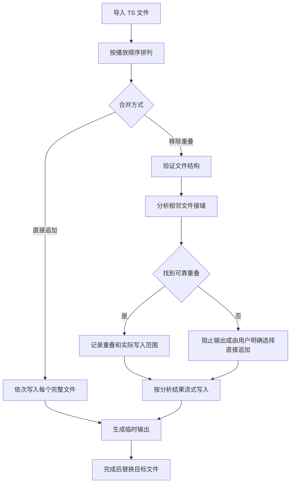

# TS 二进制合并设计方案

## 1. 目标

TS 二进制合并用于将一组封包结构一致、顺序连续的 TS 文件合成为单个文件，同时保持媒体数据不经转码或重新复用。

工具面向两类场景：

- 录制程序生成了大量可直接连续播放的 HLS TS 分片，需要按顺序首尾拼接；
- 同一来源被分段回放或录制，相邻文件包含一段完全相同的二进制内容，需要去除重叠后再拼接。

这里的“相同”特指 TS 字节完全一致，而不是节目内容、画面或音频听感相同。

## 2. 范围与非目标

### 2.1 当前范围

- 标准 188 字节 MPEG-TS；
- 多文件批量导入和自然顺序排列；
- 按当前顺序直接二进制追加；
- 查找相邻文件的后缀与前缀重叠；
- 在 TS 包边界上定位并完整验证重叠；
- 跳过被前一有效文件完整包含的文件；
- 使用有界内存流式生成输出；
- 在分析和输出期间检测源文件变化。

### 2.2 非目标

- 不转码或解码音视频；
- 不按画面、声音、PTS 或 PCR 判断内容是否相同；
- 不匹配封包方式不同但节目内容相同的录制；
- 不修复连续计数器、PCR、PTS、DTS 或 PES；
- 不重新生成 PAT、PMT、SDT 等节目表；
- 不调整输入文件内部已有的时间轴；
- 不猜测没有可靠二进制证据的接缝位置。

如果相邻文件来自不同录制工具、经历过重新复用，或者同一内容的 TS 包排列和填充方式不同，应使用面向内容对齐的其他工具，而不是二进制合并。

## 3. 两种合并方式

### 3.1 直接首尾追加

直接模式按照列表中的顺序写入每个文件的全部字节，不分析媒体内容，也不删除任何数据。

它适合原本就被切成连续分片的录制，例如同一 HLS 会话生成的多个 TS 分片。工具只负责恢复文件层面的连续排列，不承诺修正分片本身携带的封装或时间轴问题。

### 3.2 移除重叠后合并

重叠模式将每一对相邻有效文件视为一个接缝：

1. 在前一文件尾部寻找与后一文件开头相同的区域；
2. 只接受从 TS 包边界开始的候选位置；
3. 对候选区域进行完整逐字节验证；
4. 输出前一文件后，只写入后一文件中重叠区域之后的内容；
5. 对后续文件重复上述过程。

例如，两个文件分别覆盖 `00:00-10:00` 和 `09:00-20:00`，且 `09:00-10:00` 对应的 TS 字节完全一致时，输出会保留一份重叠数据，形成连续的 `00:00-20:00` 文件。

## 4. 总体流程

重叠分析与输出是两个阶段。任何文件顺序、搜索范围或源文件状态发生变化后，旧分析结果都不再有效。

## 5. 文件顺序

文件顺序直接决定最终播放顺序，也是重叠模式建立相邻关系的依据。

工具提供：

- 批量选择和拖放导入；
- 多选移除；
- 上移和下移；
- 文件名自然排序；
- 明确的顺序编号。

自然排序按数字段的实际数值排列，使 `1.ts`、`2.ts`、`10.ts` 保持符合文件管理器习惯的顺序。表格列不允许点击排序，避免用户无意中只改变视觉顺序并误解实际输出顺序。

自动排序只能根据文件名推断顺序。文件名没有可靠序号或时间信息时，仍应由用户确认。

## 6. 重叠判定原则

### 6.1 后缀与前缀关系

可靠接缝必须满足：前一文件的某段后缀与后一文件从开头起的相同长度前缀完全一致。

仅在文件中找到一小段相同数据并不足以证明接缝成立。匹配区域必须一直延伸到前一文件结尾，才能安全删除后一文件的对应前缀。

### 6.2 TS 包边界

候选起点和重叠长度都按 188 字节对齐。这样可以避免在媒体负载内部偶然出现相同字节时从半个 TS 包的位置拼接。

输入文件还需要满足：

- 文件长度能够被 188 整除；
- 开头连续多个包具有正确的同步字节；
- 文件足够容纳基本结构验证。

### 6.3 候选筛选与完整验证

分析先使用具有区分度的包特征快速缩小候选范围，再对可能的重叠区域逐字节比较。

快速筛选只用于减少磁盘读取和错误候选，不能单独决定是否删除数据。只有完整验证通过后，接缝才会标记为可靠。

### 6.4 搜索范围

最大重叠搜索范围限制前一文件尾部参与候选搜索的数据量。

范围较小时分析更快、网络读取更少，但无法发现更长的重叠；范围较大时能覆盖更长的并发回放区间，同时需要读取更多数据。用户应根据预期重叠时长和实际码率选择合理范围。

### 6.5 完整包含

如果后一文件的全部内容已经包含在前一有效文件尾部，该文件不会再次写入，也不会替代后续接缝的参考文件。

这可以处理重复加入相同分片或较短文件被前一文件完整覆盖的情况，同时保持后续匹配仍基于实际输出末尾。

## 7. 未匹配接缝

未找到可靠重叠可能意味着：

- 文件顺序错误；
- 实际重叠超过当前搜索范围；
- 两段录制没有重叠；
- 内容相同但封包字节不同；
- 源文件存在缺失或修改；
- 后一文件并非从重叠区域开始。

默认情况下，只要存在未匹配接缝，工具就不允许按重叠模式输出，避免静默产生重复内容或错误裁剪。

用户可以明确允许未匹配文件直接追加。此时可靠接缝仍会移除重叠，未匹配接缝则保留后一文件的全部字节，并在结果中单独统计。

## 8. 输出安全

### 8.1 路径保护

输出路径不能与任何输入文件相同，防止源数据在读取前被覆盖。

### 8.2 临时文件

输出先写入目标目录中的临时文件。全部写入成功后，再用临时文件替换目标路径。

这样可以保证：

- 失败或取消时不会留下看似完整的目标文件；
- 原有目标文件在新输出完整生成前不受影响；
- 临时文件与目标位于同一文件系统，最终替换不需要跨盘搬运。

### 8.3 源文件变化

分析阶段记录文件路径、大小和修改时间。输出前会确认分析结果仍对应当前文件，写入过程中也会再次检查源文件状态。

如果录制程序仍在写入文件，或文件在分析后被替换，工具会停止使用旧分析结果，要求重新分析。

## 9. 性能与内存

### 9.1 直接模式

直接模式主要受源盘读取速度和目标盘写入速度限制。所有文件顺序读取，内存只保存固定大小的复制缓冲区，不随文件总大小增长。

### 9.2 重叠模式

重叠分析的成本主要来自：

- 搜索前一文件尾部的候选包；
- 验证候选重叠的完整字节；
- 网络盘上的随机读取延迟。

候选特征用于减少不必要的完整比较。即使处理大文件，内存仍只保留有限的探测、扫描和比较缓冲区，不保存完整文件或完整重叠区域。

### 9.3 大量分片

文件列表支持虚拟化展示，批量读取文件信息限制并发度。直接模式可以处理数百至数千个小分片，而不会为每个文件长期保留媒体数据。

## 10. 界面状态

两种方式共享同一文件列表、顺序、输出路径和进度区域，因此在同一窗口内使用互斥模式切换。

切换方式时：

- 保留文件列表、排列顺序和输出路径；
- 清除只属于上一方式的分析结果；
- 重置进度、速度和结果提示；
- 显示当前方式对应的操作说明。

清空列表时，文件、输出路径、分析结果、进度和速度都会一并恢复到初始状态。

## 11. 结果解释

重叠分析会展示：

- 每个文件与哪一个前置有效文件匹配；
- 找到的重叠大小；
- 该文件实际写入的字节范围；
- 文件是否未匹配或被完整覆盖；
- 可靠接缝数量、预计移除量和预计输出大小。

这些结果描述的是文件字节关系，不代表输出已经通过解码、连续计数器或时间轴检查。需要判断媒体质量时，应继续使用 TS 快速检查或播放器验证。

## 12. 已知限制

- 只支持 188 字节包结构；
- 只能分析列表中相邻有效文件的接缝；
- 只识别完全相同的二进制重叠；
- 搜索范围不足时可能找不到真实重叠；
- 重复空包或高度重复数据会增加候选筛选成本；
- 直接追加独立录制文件可能保留时间轴跳变或重复内容；
- 合并本身不会掩盖或修复源文件中已有的传输错误。

## 13. 验证策略

测试至少应覆盖：

- 直接模式保持所有输入字节和顺序；
- 可靠后缀与前缀重叠只保留一份；
- 未匹配接缝默认阻止输出；
- 明确允许时未匹配文件完整追加；
- 完整包含的文件不影响下一接缝；
- 大量小分片能够流式合并；
- 自然排序正确处理不同位数的序号；
- 输出路径与源文件冲突时拒绝执行；
- 取消或失败后不留下不完整目标文件。

## 14. 后续扩展方向

在保持保守判定的前提下，可继续考虑：

- 根据文件名中的时间信息提供顺序检查；
- 为超大搜索范围增加更细粒度的 I/O 统计；
- 导出接缝分析报告；
- 在输出后提供快速封装检查入口。

这些扩展不应改变“只有完整验证通过才删除重叠数据”的基本安全原则。
