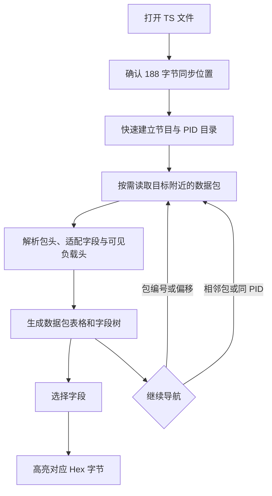

# TS 包查看器设计方案

## 1. 目标

TS 包查看器用于只读观察 MPEG-TS 文件中的单个 188 字节包，把表格中的封装信息、字段树和原始十六进制字节关联起来，帮助用户确认某个具体包在文件中的结构和含义。

主要使用场景包括：

- 根据快速检查报告中的包编号或文件偏移定位异常；
- 查看 PID、连续计数器、适配字段和负载起始状态；
- 检查 PCR、PTS、DTS 在包内的原始字段；
- 观察 PES 或 PSI 起始包的基础结构；
- 点击字段后确认其对应的原始字节范围；
- 在相邻包或同一 PID 的包之间快速移动。

它与 TS 快速检查的分工不同：快速检查负责顺序扫描完整文件并发现全局异常，包查看器负责在已知位置附近进行逐包解释和人工核对。

## 2. 范围与非目标

### 2.1 当前范围

- 标准 188 字节 MPEG-TS；
- 识别文件中的首个可靠同步位置；
- 按包编号或文件偏移随机定位；
- 分页查看当前目标附近的包；
- 显示 PID、TEI、PUSI、CC、适配字段状态和可见时间戳；
- 解析 TS 包头、适配字段、部分 PES 头和 PSI 起始字段；
- 字段树与 Hex 字节范围联动；
- 对当前窗口中的明显结构、TEI 和连续性异常着色；
- 使用节目表目录补充 PID 对应的节目和流类型说明；
- 支持界面本地化以及固定标准字段名两种表达。

### 2.2 非目标

- 不修改或输出 TS 文件；
- 不对完整文件建立逐包索引；
- 不替代快速检查的全局异常扫描；
- 不重组跨包的完整 PSI section 或 PES；
- 不解码音视频 ES；
- 不验证画面、声音或编码帧是否可解码；
- 不解析 MPEG-TS 及各类私有扩展中的全部可选字段；
- 不自动跳转到所谓“上一个异常”或“下一个异常”。

## 3. 总体流程



打开阶段只建立解释当前包所需的基础目录。之后的浏览、跳转和搜索都采用按需读取，不会因为打开一个大文件而长期保存全部包数据。

## 4. 同步位置与包编号

### 4.1 初始同步

查看器不会假定文件首字节一定是 `0x47`，而是复用 TS 分析能力寻找连续可靠的 188 字节包边界。

同步位置之前的字节作为文件前置数据保留在偏移关系中，但不计入 TS 包编号。这样可以正确处理带有少量前置字节、但主体仍为标准 188 字节 TS 的文件。

### 4.2 包编号

第一个同步包编号为 0，后续包编号按 188 字节递增。包编号与文件偏移之间的关系为：

```text
文件偏移 = 同步偏移 + 包编号 × 188
```

文件末尾不足 188 字节的残余数据不构成完整包，也不会出现在包列表中。

## 5. 按需窗口

查看器一次只展示目标位置附近的有限数量数据包，而不是把全文件转换成界面行对象。

当用户跳转到新位置时：

1. 计算目标附近的窗口起点；
2. 读取该窗口以及少量前置预热包；
3. 使用预热包建立局部连续计数器状态；
4. 只把正式窗口中的包显示到表格；
5. 选中用户请求的目标包。

前置预热用于降低窗口首行缺少连续性基线造成的误判，但它仍然是局部判断。距离当前窗口更早的 discontinuity、丢包或录制边界不会被完整追溯。

## 6. 导航方式

### 6.1 包编号跳转

用户可以输入包编号并按回车或点击跳转。编号必须位于当前文件的完整包范围内。

### 6.2 文件偏移跳转

偏移支持十进制以及以 `0x` 开头的十六进制形式。输入位置落在某个 TS 包内部时，查看器选择包含该偏移的包，而不是要求用户手工对齐到包首字节。

同步位置之前或文件范围之外的偏移不会被接受。

### 6.3 相邻导航

上一包、下一包用于逐包观察；前后窗口导航用于快速跨越一组数据包。到达文件开头或结尾时，对应操作不可用。

### 6.4 同 PID 导航

同 PID 导航从当前包向前或向后分块搜索，找到第一个 PID 相同的有效包后定位到该位置。

搜索过程不预建全文件 PID 索引，因此内存不会随文件长度增长。代价是远距离搜索需要读取中间数据，网络盘或机械硬盘上的耗时可能明显高于相邻包导航。

## 7. 数据包表格

每行代表一个完整 TS 包，主要展示：

- 包编号；
- 文件字节偏移；
- PID 及对应流说明；
- TEI；
- PUSI；
- continuity_counter；
- adaptation_field_control；
- 当前包内可直接读取的 PCR、PTS、DTS。

PID 说明来自打开文件时建立的节目表目录，可包含节目号、视频或音频编码、语言、PCR 和 PMT 等角色。没有足够目录信息时仍显示 PID，不凭媒体负载猜测完整节目关系。

## 8. 局部异常着色

表格使用与快速检查一致的错误和警告颜色表达以下情况：

- 同步字节或包结构无效；
- transport_error_indicator 被置位；
- adaptation_field_control 使用保留值；
- 适配字段长度越过当前包边界；
- 当前局部窗口内出现连续计数器缺口；
- 连续计数器重复且负载不同；
- 连续计数器重复但包负载相同。

完全相同的重复包显示为警告，冲突重复和连续性缺口显示为错误。Null PID 不参与连续性判断，只有带负载的包推进计数器基线；显式 discontinuity 会重置对应 PID 的局部基线。

着色只解释当前读取窗口及其前置预热范围，不能据此断言整份文件没有其他异常。需要完整结论时应使用 TS 快速检查。

## 9. 字段树

### 9.1 TS 包头

包头展示：

- sync_byte；
- transport_error_indicator；
- payload_unit_start_indicator；
- transport_priority；
- PID；
- transport_scrambling_control；
- adaptation_field_control；
- continuity_counter。

位字段同时保留其所在字节和位范围，便于从数值回到原始编码。

### 9.2 适配字段

当前解析包括适配字段长度、各功能标志以及包内完整存在的 PCR。OPCR、拼接点、私有数据和适配扩展会显示对应标志，但不会继续展开所有可选扩展结构。

### 9.3 PES 起始包

当负载以 PES 起始码开始时，可展示：

- 起始码前缀；
- stream_id；
- PES_packet_length；
- 可选头标志和头长度；
- 当前包内能够完整定位的 PTS、DTS。

查看器只解释当前包中可见的 PES 头，不跨包重组被截断的头部。

### 9.4 PSI 起始包

对已知 PSI/SI PID 的负载起始包，可展示 pointer_field、table_id 和 section_length 等基础字段。

完整 section 的跨包组装、CRC 和节目结构判断仍由 TS 快速检查负责。

### 9.5 标准字段名

默认字段名称和部分枚举值跟随界面语言。启用“标准字段名”后，名称使用固定的下划线形式，例如 `continuity_counter` 和 `payload_unit_start_indicator`，不再随语言变化。

该模式方便熟悉规范的用户对照资料，也便于不同语言环境下交流字段名称。

## 10. Hex 联动

Hex 区固定显示所选包的 188 字节内容，包括：

- 每行字节偏移；
- 十六进制字节；
- 可打印 ASCII；
- 当前字段对应的高亮范围。

字段树中的每个节点都保存包内起点和长度。选择字段后，Hex 区直接高亮对应字节，不复制或改写包内容。

对于只占一个或数个位的字段，当前高亮覆盖其所在的完整字节；字段树中的位范围用于进一步确认具体位。这样既保持字节视图清晰，也避免在 Hex 单元格内部绘制难以辨认的局部位选择。

Hex 使用跨平台等宽字体选择策略，界面其他区域继续使用系统默认字体。颜色取自应用公共主题资源，以适配浅色和深色模式。

## 11. 节目与流识别

打开文件时会在有限探测范围内读取 PAT、PMT、SDT 和必要描述符，用于建立 PID 目录和流说明。目录稳定后即可停止探测，不需要预先扫描完整文件。

这部分复用快速检查和流过滤器已有的节目、描述符及编码识别能力，避免包查看器维护另一套流类型字典。

如果节目表缺失、出现过晚或在探测范围外发生变化，后续包仍然可以查看，但流说明可能只显示 PID 或有限角色。

## 12. 性能与内存

### 12.1 打开文件

初始成本来自同步确认和有限节目表探测，规模与探测范围有关，而不是与完整文件时长线性增长。

### 12.2 浏览窗口

界面只保存当前窗口的包字节、解析结果和行对象。切换窗口后旧数据被释放，因此大文件不会产生与总包数成比例的托管内存占用。

### 12.3 同 PID 搜索

搜索复用固定大小的分块缓冲，并直接读取目标文件，不保留完整 PID 索引。近距离匹配通常很快，远距离匹配的主要成本是磁盘或网络顺序读取。

### 12.4 字段解析

包头解析基于固定 188 字节数据和轻量值状态。字段树和展示字符串只为当前窗口中的包及当前选中包创建，不进入全文件扫描热路径，也不会降低普通快速检查的扫描速度。

## 13. 只读与生命周期

查看器以共享只读方式打开源文件，不写入源文件，也不生成临时输出。关闭窗口或打开其他文件时会取消正在进行的读取和搜索，并释放文件句柄。

如果外部程序在查看期间替换或缩短文件，后续读取可能失败或返回新的内容。查看器不把正在增长的录制文件视为稳定快照，也不承诺自动跟踪新增包。

## 14. 已知限制

- 只支持 188 字节包结构；
- 不为完整文件建立异常索引；
- 连续性着色是局部窗口判断；
- 不跨包重组 PSI section 或 PES 头；
- 只解析当前已支持的 TS、适配字段、PES 和 PSI 基础字段；
- 私有描述符和编码识别受初始节目表探测结果限制；
- 同 PID 远距离搜索在慢速存储上可能耗时；
- 字段高亮以字节为最小视觉单位，不在 Hex 单元格内区分单个位。

## 15. 验证策略

测试至少应覆盖：

- 带前置字节的文件仍能得到正确同步偏移和包编号；
- 包编号与十进制、十六进制文件偏移能够互相定位；
- 文件开头、结尾和窗口边界导航正确；
- 同 PID 搜索可以跨越多个读取分块；
- TS 头和适配字段标志解析正确；
- 非法适配字段长度不会越界读取；
- 特殊 PES stream_id 不会被误判为带通用可选头；
- PCR、PTS、DTS 的字节范围和显示值一致；
- PSI 起始字段只在适用 PID 上展开；
- 字段选择映射到正确的 Hex 字节范围；
- 重复包、冲突重复、连续性缺口和 discontinuity 的局部着色符合快速检查语义；
- 大文件浏览和同 PID 搜索不会建立全文件对象或 PID 索引。

## 16. 后续扩展方向

在保持按需读取和只读定位的前提下，可继续考虑：

- 扩充适配字段可选结构；
- 展开更多常见 PSI/SI 表的当前 section 字段；
- 允许从快速检查详情直接带入包编号和偏移打开查看器；
- 提供选中包的结构化文本复制；
- 对正在增长的录制文件提供明确的手动刷新入口。

这些扩展不应把包查看器变成另一个全文件扫描器，也不应为了导航而长期保存与文件大小成比例的数据。
