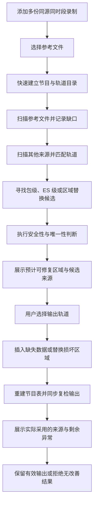

# TS 多源修复设计方案

## 1. 目标

多源修复用于处理这样的场景：同一播出信号、同一时间段被多个录制工具分别保存，但各录制文件在不同位置存在丢包或损坏。

工具以其中一份录制作为参考版本，从其他录制中寻找参考版本缺失的内容，尽可能生成缺口更少的新 TS 文件。

该方案不追求理论上的完美恢复，而是强调：

- 能利用多份录制之间的互补关系；
- 支持不同 PID、PES 组织和 TS 封包方式；
- 允许不同来源保留的轨道数量不同；
- 在无法可靠确认时放弃修复；
- 最终文件即使仍有少量缺口，也不应因为错误拼接而产生更严重的问题。

## 2. 适用条件

### 2.1 可以使用的来源

来源文件应满足：

- 来自同一播出信号或同一内容时间线；
- 录制时间段存在有效重叠；
- 音视频编码内容本质上相同；
- 不要求 PID、节目号、封包边界或保留轨道完全一致。

典型差异可以包括：

- 不同录制工具使用了不同 PID；
- PES 切分位置不同；
- TS 包中的适配字段不同；
- 一份文件只保存主音轨，另一份保存全部音轨；
- 节目信息和节目单的保留程度不同。

### 2.2 不适用的来源

以下情况不能仅凭本方案可靠修复：

- 同一节目在不同时间的重播；
- 相同画面经过重新编码、转码或帧率转换；
- 不同地区插播、广告或节目编排不同；
- 音频被重新混音、重采样或响度处理；
- 两份录制没有足够长的重叠区间；
- 加扰内容无法取得稳定、可比较的负载。

“节目名称相同”并不足以说明来源兼容，关键是内容时间线和基本流字节能够对应。

## 3. 范围与非目标

### 3.1 当前范围

- 处理 188 字节 TS 包；
- 检测连续计数器和传输错误；
- 检测带明确长度的 PES 边界异常，并关联检查同节目视频基本流差异；
- 按节目和轨道建立来源之间的对应关系；
- 支持 TS 包级、ES 级和媒体区域替换等修复路径；
- 允许用户选择最终保留的轨道；
- 重建与输出轨道相符的 PAT、PMT；
- 可选择保留频道信息和节目单；
- 在输出过程中同步复核结果，并提供修复来源矩阵和时间轴视图。

### 3.2 非目标

- 不通过解码器推测丢失的图像或声音；
- 不生成不存在于任何来源中的媒体内容；
- 不对重新编码后的近似画面做视觉匹配；
- 不保证恢复丢失包中原有的全部适配字段信息；
- 不保证每一个连续性缺口都可修复。

## 4. 总体流程

整个过程分为“目录识别”“缺口发现”“来源匹配”“候选验证”“输出重建”和“结果复检”六个阶段。

## 5. 来源与轨道识别

### 5.1 参考文件

参考文件决定：

- 输出时间线的主体；
- 需要修复的缺口位置；
- 默认节目结构和轨道列表；
- 未被修复部分的原始 TS 包顺序。

因此，通常应选择整体最完整、节目结构最符合预期的一份录制作为参考文件。

### 5.2 初步轨道匹配

轨道首先依据以下信息建立候选关系：

- 流类型；
- 所属节目；
- 语言描述；
- 字幕或私有流描述；
- PID 是否相同。

当节目结构一致，且同一节目中相同 PID 只对应一条兼容轨道时，可以将其作为强映射关系，
减少不必要的全局搜索。该映射用于确定轨道关系，实际修复区间仍需通过局部锚点、时间关系
和候选完整性验证，不能仅凭 PID 写入数据。

其他元数据主要用于缩小范围，不能单独证明两条轨道内容一致。例如，多条同语言音轨可能具有相同流类型和描述。

### 5.3 内容指纹确认

为避免将相似元数据误认为同一轨道，方案还会从轨道内容中抽取分散指纹。

指纹具有两个作用：

1. 确认参考轨道和辅助轨道来自同一内容时间线；
2. 在多音轨、静音片段或 PID 不同的情况下消除歧义。

多份录制可以具有不同的起始时间，因此不要求参考文件的全部采样指纹都能在辅助来源中出现。
只要重叠区间内存在足够多、相互独立且关系稳定的匹配指纹，即可确认轨道身份；重叠不足
或匹配集中在过短区间时仍视为不可靠。

指纹只保存少量采样结果，不保存完整 ES，因此不会随着文件时长线性占用大量内存。

## 6. 缺口识别

参考文件按 PID 跟踪连续计数器。当带负载的 TS 包出现计数跳变时，记录一个潜在缺口。
带负载且设置传输错误标志的包则作为已知损坏包处理：保留错误前的可靠锚点，将连续的
损坏包聚合为损坏区域，并记录需要在输出时丢弃的参考包位置。

除了连续计数器缺口，工具也会比较带明确长度字段的 PES 实际边界。当 CC 连续但
`PES_packet_length` 与下一 PES 边界不一致时，将相邻异常聚合为 PES 异常区域。
这种情况常见于重新封装、错误修复或包被增删后重新编号，不能只通过修改长度字段
判断媒体内容已经恢复。

缺口记录包含：

- 所属 PID 和节目轨道；
- 缺口在参考文件中的插入位置；
- 需要替换时，损坏参考包的准确位置；
- 期望的连续计数器；
- 缺口前后的负载锚点；
- 在可用时记录的 ES 锚点；
- PES 和音频帧边界状态。

连续计数器只有有限位数，因此它只能提供缺失包数量的模信息，不能在所有情况下给出唯一数量。修复候选还必须结合前后锚点和长度约束确认。

遇到显式 discontinuity 或无法继续信任的边界时，相关状态会被重置，避免把不连续的两段
内容错误拼接。传输错误包本身优先作为可替换的损坏区域处理；只有无法建立可靠前后关系时，
才放弃该区域并重置相关状态。

## 7. 多路径修复策略

### 7.1 TS 包级修复

包级修复尝试在辅助来源中找到与参考缺口前后负载序列一致的 TS 包区间。

适用条件：

- 两份录制的 TS 负载切分较接近；
- 缺口前后存在唯一、稳定的包负载锚点；
- 辅助来源对应区间本身没有连续性错误。

输出时：

- 使用辅助来源的完整 TS 包；
- 将 PID 改写为参考轨道的 PID；
- 重新建立连续计数器；
- 保留候选包原有的负载、PUSI、适配字段和时间信息。

包级修复保留的信息最多，因此在包级和 ES 级候选同时存在时，应优先使用可靠的包级候选。

### 7.2 ES 级修复

当两个录制工具采用不同 PES 或 TS 封包方式时，包级指纹通常无法对应。此时将 PES 头从媒体负载中剥离，把轨道视为连续 ES 字节流进行匹配。

ES 级修复通过缺口前后的 ES 锚点，在辅助来源中定位同一段媒体字节，并提取中间缺失部分。
候选必须能够精确重封装为参考缺口推导出的 TS 包数，避免补入正确媒体字节后改变参考时间线
后续包的连续计数关系。

短缺口未跨越 PES 时，可直接将缺失 ES 重新装入新的 TS 包。视频缺口确实跨越 PES 时，
还会记录辅助来源中完整的 PES 头及其对应 ES 位置，并在合成包中恢复 PUSI、PES 边界和
PTS/DTS。时间戳会转换到参考时间线；视频 PES 的长度字段可按合法的未指定长度处理，
避免不同复用器的 PES 切分方式截断后续负载。

该路径不会凭空推测未知的 PCR、适配字段扩展或媒体内容。跨 PES 合成只在边界、时间戳、
编码起始码和目标包数都可证明一致时启用，否则仍按不可修复处理。

### 7.3 PES 异常区域替换

对于 CC 连续但 PES 长度不一致的轨道，工具以异常区域前后的连续正常 PES 作为锚点，
在辅助来源中寻找同一段完整内容。只有辅助区间自身 PES 长度正常、前后指纹匹配且
呈现时间跨度一致时，才允许替换。

输出时会跳过参考轨道异常区域内的包，复制辅助来源的完整 PES 包，并将 PTS/DTS
平移到参考时间线，同时重新建立该 PID 的连续计数器。这样修复的是实际媒体内容，
而不是仅将错误的长度字段改成当前字节数。

时间线计算会先将 33 位 PTS/DTS 展开为连续内部时间，避免录制跨越时间戳回绕点时把
正常前后关系误判为大幅倒退；写回输出时再按标准位宽编码。

相邻异常之间只有在持续出现足够长的正常 PES 后才分为两个区域，避免一次短暂错位
被拆成大量互相影响的小修复操作。

### 7.4 关联视频 ES 修复

H.264/H.265 广播流常将 `PES_packet_length` 设为零。此时 TS 连续计数、TEI 和
PES 边界都可能正常，但视频 ES 内部仍已缺字节或损坏，轻量结构扫描无法直接证明
画面可正常解码。

多源修复不会因此对整段视频执行深度解码，而是利用同节目其他轨道已经确认的异常
时间窗，选择性检查对应视频。视频候选必须同时满足：

- 视频轨道已通过大量分散的包或 ES 指纹确认属于同一编码内容；
- 多个视频指纹形成稳定且占多数的时间偏移；
- 异常区间前后具有更长的连续 PES/ES 指纹锚点；
- 辅助来源候选区间自身没有 CC 或 TEI 异常；
- 候选时间偏移与视频全局指纹推导的偏移一致。

候选闭合后会剥离两端完全相同的 PES，只保留中间真正不同的 ES 区域。若参考与
辅助区域的 ES 总长度相同，输出保留参考文件的 TS、适配字段、PCR、PES 头和时间戳，
仅覆盖媒体负载。若参考侧确实缺少 ES 字节，则使用辅助来源的有界 TS/PES 区间作为
载体，并将 PID、连续计数器、PTS、DTS 和 PCR 平移到参考时间线。

区域替换以轨道时间线为整体处理，覆盖区间内属于同一 PID 的 PCR 包和仅含适配字段的包
也会纳入复制或丢弃范围，避免媒体负载已经替换但时钟或包顺序仍来自不一致的旧区间。

这种策略不要求按完整 GOP 替换，也不把 FFmpeg 或其他解码器加入产品扫描路径；
无法用指纹和时间关系证明正确的区间会直接放弃。

## 8. ES 级安全边界

### 8.1 通用约束

ES 候选必须同时满足：

- 辅助轨道已通过全局内容指纹确认；
- 前后 ES 锚点完整且匹配；
- 缺口长度与连续计数器信息相容；
- 未跨 PES，或跨越的每个 PES 边界均有完整头部、可转换时间戳和可靠编码边界；
- 修复范围处于受控上限以内；
- 辅助来源对应区间没有自身缺口。

### 8.2 H.264 与 H.265

H.264/H.265 使用 Annex-B 起始码划分 NAL 单元。

位于同一 PES 内的短缺口原则上只在单个 NAL 单元内部修复，避免跨 NAL、访问单元或参数集
进行无依据拼接。

如果缺口跨越了辅助来源的 PES 边界，则只有在参考时间戳有效、完整 PES 头可恢复，并且
每个 PES 边界都与 Annex-B 起始码对齐时才允许继续。这样既能处理不同复用器的 PES 切分
差异，又不会把任意 NAL 片段直接拼接到一起。

### 8.3 MPEG-2 Video 与 AVS 视频家族

MPEG-2 Video、AVS+、AVS2 和 AVS3 都使用起始码区分 sequence、picture、slice 等语法单元。

这些编码的 slice 起始码可能非常密集。如果禁止跨越任何起始码，实际可修复率会很低。因此采用分级规则：

- 允许在同一 picture 内跨越一个或多个 slice；
- 拒绝跨越 sequence、picture、extension 等高层边界；
- 跨 PES 时要求完整 PES 头与对应起始码对齐；
- 仍要求目标包数、时间关系和全局内容指纹全部有效。

### 8.4 音频

对于具有明确帧结构的音频，先持续跟踪帧同步和帧长。只有连续确认多个合法帧后，才信任当前帧内位置。

当前可进行帧边界验证的类型包括：

- MPEG Audio Layer I、II、III；
- AAC ADTS；
- AAC-LATM/LOAS；
- AV3A。

音频修复范围必须位于已确认的音频帧和 PES 内，当前不跨音频 PES 合成。其他已识别音频
仍可使用通用 PES 内修复，但安全条件更保守。

## 9. 多轨道与不完整来源

不同来源不必具有相同的轨道集合。

例如：

- 参考文件包含视频和多条音轨；
- 辅助文件只包含视频和其中一条音轨；
- 该辅助文件仍可用于修复内容一致的那条音轨；
- 未出现或无法确认的轨道不会被强制加入输出。

用户最终按参考文件的轨道列表选择保留内容。输出可以是完整节目，也可以只保留视频、单条音频或其他需要的轨道。

## 10. 输出重建

输出以参考文件为主线顺序读取，并根据异常类型采用不同操作：

- 对普通连续性缺口，在定位点插入已确认的缺失包；
- 对带传输错误标志的损坏包，丢弃已记录的参考包并写入辅助来源中的正确内容；
- 对跨 PES 的视频 ES 缺口，按参考缺失包数重封装媒体字节，并恢复必要的 PUSI、PES 头和时间戳；
- 对 PES 或视频异常区域，整体跳过参考区间并写入完成时间线转换的候选区间；
- 对未命中可靠候选的区域，保持参考内容不变，不进行猜测性拼接。

同时根据用户选择：

- 生成与输出节目相符的 PAT；
- 生成只包含保留轨道的 PMT；
- 保留必要的 PCR；
- 可选保留频道信息和节目单；
- 丢弃未选中的媒体 PID。

这样可以避免“媒体轨道已经删除，但 PMT 仍宣告该轨道”的结构性错误。

输出缓冲在写盘过程中会同步对用户所选轨道进行轻量结构复检，比较修复前后的连续性错误、
传输错误和 PES 结构错误。复检只维护有界的 PID 与 PES 状态，不保存媒体负载，也不需要在
输出完成后重新读取整个文件。复检结果既决定输出是否可保留，也用于向用户报告仍然存在的
异常数量。

## 11. 修复地图

修复地图在来源分析完成后即可打开，不要求先生成输出文件。它用于回答两个不同问题：

1. 哪些异常区域存在可用候选，以及候选来自哪一份辅助文件；
2. 真正输出后，哪些候选被采用，哪些区域被跳过或仍无法修复。

来源矩阵以“异常区域 × 辅助来源”展示可用性，并区分可用候选和最终采用来源；时间轴则按
轨道展示异常在参考时间线中的位置。区域详情包含轨道、异常类型、0-based 时间、包与文件
位置、匹配方式、候选包数，以及流中存在 TDT/TOT 时推算出的广播 UTC。

预计视图来自扫描和候选分析，实际视图来自输出计划与写入结果。两者分离可以避免把
“存在候选”误解为“最终一定写入”，也方便解释因轨道未选择、候选冲突或安全检查而跳过的区域。

## 12. 性能与内存设计

### 12.1 流式扫描

各来源的主扫描均采用顺序读取，不缓存完整 TS、PES 或 ES。只有在异常密集且需要进一步
定位 ES 候选时，才对已经缩小的时间窗进行额外范围读取。

### 12.2 有界状态

内存中只保留：

- 每个 PID 的连续性状态；
- 少量前后锚点；
- 分散的内容指纹；
- 有上限的缺口和候选；
- 短期音频帧头状态。

视频 PES 索引只在多源修复且确有相关轨道时建立，并设置明确上限；普通快速扫描
不会创建该索引。

### 12.3 按需分析

节目目录识别、详细异常记录、时间轴和修复指纹属于不同用途。多源修复只启用其真正需要的部分，避免复用普通扫描器时无意义地保存大量事件或时间轴数据。

### 12.4 热路径原则

- 以顺序读取为主；
- 已知帧内负载按块跳过，不逐字节深度解析；
- 不调用音视频解码器；
- 只在候选位置执行较严格的边界判断。

当异常较密集时，主扫描先建立稀疏的时间与文件位置索引，再把互不重叠的候选时间窗分组
匹配。计算密集窗口可以有限并行处理，最终结果仍按稳定顺序合并；并行度和窗口缓冲均受控，
避免内存随文件大小或异常数量无界增长。

## 13. 失败处理与保守原则

出现以下情况时不进行修复：

- 轨道内容指纹无法确认；
- 前后锚点不唯一或不完整；
- 辅助来源在候选区间也有缺口；
- 缺口跨越不允许的语法边界，或跨 PES 信息不足以安全重建；
- PES 或音频帧状态无法确认；
- 推算的包数与连续计数器不相容；
- 候选范围超过安全上限。

核心原则是：无法证明候选正确时，不把它写入输出。

工具允许输出仍存在少量未解决异常的部分修复结果，但必须由输出复检证明：用户所选轨道
的连续性错误、传输错误和 PES 结构错误总数相较参考文件确有下降。如果错误数没有改善或
出现增加，则拒绝该结果并删除候选输出，避免把“完成写入”误当成“修复有效”。

## 14. 验证方案

### 14.1 人工造错

从一份完整 TS 生成多个封包方式不同但 ES 内容一致的录制版本，再分别删除不同位置的 TS 包。
除直接删除外，还应覆盖传输错误标志损坏、PES 内容错位以及损坏包仍占据原位置等情况。

### 14.2 功能验证

- 缺口能够被发现；
- 不同 PID 的同一轨道能够匹配；
- 包级和 ES 级路径均能命中；
- 视频 ES 缺口跨越 PES 时，能够恢复 PUSI、PES 头和参考时间线上的 PTS/DTS；
- 带传输错误标志的参考包会被正确替换，而不是与修复数据同时保留；
- 用户选择的轨道集合与输出 PMT 一致；
- 输出不再出现已修复位置的连续性错误；
- 不同录制起始时间下，重叠轨道仍能可靠匹配；
- 跨越 33 位 PTS/DTS 回绕点时，时间线保持连续；
- 视频替换区域中的 PCR 和仅含适配字段的包得到一致处理；
- 复检能够报告剩余错误，且保留结果的所选轨道错误总数低于修复前。
- 修复地图的预计来源、实际采用来源和输出计划保持一致。

### 14.3 字节一致性验证

分别提取修复后轨道和未损坏基准轨道的 ES，比较完整哈希。哈希一致说明修复后的媒体字节与基准完全相同。

### 14.4 结构验证

- PAT、PMT CRC 正确；
- PID 与连续计数器合法；
- PTS、DTS、PCR 没有因修复引入新的跳变；
- 所选轨道修复后的连续性、传输和 PES 结构错误没有增加；
- 常用分析器能够正确识别节目和轨道。

开发测试可额外使用解码器对参考、辅助与输出文件做离线对比，以确认真实视频解码
异常没有增加。该验证不属于用户执行扫描或修复时的必经步骤。

## 15. 已知限制

- 仅支持 188 字节 TS 包；
- 不处理重新编码后只有画面相似、字节不同的来源；
- ES 合成不能恢复丢失包中未知的 PCR 或其他适配字段扩展；只有完整区域替换时才能保留并转换辅助来源已有的对应信息；
- 连续计数器回绕使超长连续缺口存在数量歧义；
- 过短录制可能没有足够的分散指纹确认轨道；
- 录制文件首尾没有辅助来源覆盖的非重叠部分无法修复；
- 极端重复内容可能降低局部锚点的唯一性；
- 不同来源同时在同一位置损坏或不存在可用重叠区间时无法互补，输出可能仍残留少量异常；
- 私有编码或缺少可靠边界语法的流只能使用更保守的策略。

## 16. 后续可扩展方向

- 增加更多编码的轻量边界解析；
- 允许用户在多个可靠候选之间手动指定来源，并展示更细的置信度依据；
- 支持三个以上来源对同一缺口进行交叉投票；
- 增加修复前后质量对比报告；
- 在不增加普通扫描内存负担的前提下，提供可选的高级修复索引；
- 对较长录制增加分段匹配和时间轴漂移校正。
