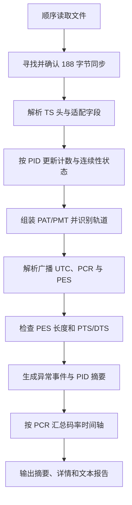

# TS 快速检查设计方案

## 1. 目标

TS 快速检查用于在不进行完整音视频解码的情况下，快速判断传输流是否存在明显的封装、连续性、节目表、时钟和时间戳问题，并给出可定位的异常时间点。

主要关注：

- 是否失去 TS 同步；
- 是否存在传输错误或连续计数器缺口；
- PAT、PMT 是否有效；
- 带明确长度的 PES 是否在下一边界前完整结束；
- PCR、PTS、DTS 是否倒退或异常跳变；
- 音频是否出现明显时间间隔；
- 音视频相对时间线是否持续漂移；
- 各 PID 的包数量、占比和错误统计；
- 整体码率及异常时间轴；
- 流中 TDT/TOT 提供的广播 UTC 时间范围。

## 2. 设计定位

快速检查是封装层和时间轴层面的检查工具，不是深度解码器。

它的优势是：

- 扫描速度接近磁盘顺序读取速度；
- 不受视频分辨率和编码复杂度显著影响；
- 能处理很长的录制文件；
- 可以在一次扫描中同时生成摘要、详情和时间轴。

它不能证明每一帧都能正确解码，也不能发现只存在于像素、宏块或频谱层面的编码损坏。

## 3. 范围与非目标

### 3.1 当前范围

- 188 字节 MPEG-TS；
- TS 头和适配字段合法性；
- PID 统计；
- 连续计数器；
- PAT、PMT 组装和 CRC；
- PMT 流类型与描述符识别；
- PES 声明长度与实际负载长度一致性；
- PCR、PTS、DTS；
- DVB TDT/TOT 广播 UTC；
- 音视频时间线漂移；
- 码率时间轴；
- 文本报告导出。

### 3.2 非目标

- 不解码视频画面；
- 不检查编码块、参考帧或运动矢量；
- 不分析音频采样值；
- 不自动修复异常；
- 不替代专业广播监测设备的全部标准项目。

## 4. 总体流程

## 5. TS 同步与包结构检查

### 5.1 初始同步

扫描开始时不会只依赖一个 `0x47` 字节，而是要求多个固定间隔的同步字节连续出现，以降低媒体负载中偶然字节被误认为 TS 包头的概率。

同步点之前的数据被视为前置字节，不参与 TS 包解析。

### 5.2 中途失步

如果预期包边界不再出现同步字节，扫描器会在当前缓冲区中尝试重新寻找连续同步点。

恢复成功时记录：

- 失步开始位置；
- 跳过的字节数；
- 恢复后的大致时间点。

如果文件结束前仍无法恢复，则记录末尾失步。

### 5.3 包头合法性

每个包检查：

- transport_error_indicator；
- PID；
- adaptation_field_control；
- continuity_counter；
- adaptation_field_length；
- discontinuity_indicator；
- PCR 标志及 PCR 字段长度。

## 6. 连续性检查

连续计数器用于发现带负载 TS 包的缺失、重复或顺序异常。

### 6.1 正常规则

- 同一 PID 的带负载包应按模 16 递增；
- 仅含适配字段的包不要求递增；
- Null PID 不参与媒体丢包判断；
- 遇到显式 discontinuity 时重置连续性基线。

### 6.2 重复包

如果连续计数器重复：

- 包体完全相同，视为重复包并给出警告；
- 包体不同，视为冲突重复并给出错误。

### 6.3 连续性缺口

计数器既没有重复，也不等于期望值时，记录连续性缺口。

缺口报告包含：

- PID；
- 包序号与文件偏移；
- 期望和实际连续计数器；
- 可推算的最小缺失包数；
- 对应的播放时间点。

连续计数器位数有限，因此长缺口只能得到模意义上的数量，报告不把它解释为绝对精确的丢包数。

## 7. 节目表与轨道识别

### 7.1 PSI section 组装

PAT、PMT 可能跨多个 TS 包。扫描器根据 PUSI 和 pointer field 组装完整 section，并在完成后检查 CRC。

连续性中断时丢弃未完成 section，防止把缺失数据拼成伪节目表。

### 7.2 PAT

PAT 用于建立：

- Transport Stream ID；
- 节目号；
- 每个节目的 PMT PID。

### 7.3 PMT

PMT 用于建立：

- PCR PID；
- 视频、音频、字幕和数据 PID；
- stream_type；
- 节目级描述符；
- ES 描述符；
- 语言和注册标识。

### 7.4 补充识别

部分私有流不能只凭 stream_type 判断，需要结合描述符或 registration descriptor 识别，例如部分音频、字幕、元数据和广播扩展。

MPEG Audio 的 Layer 信息通过少量帧头探测补充，不进行完整音频解码。

### 7.5 DVB 广播时间

PID `0x0014` 承载 DVB TDT/TOT，不属于未知私有 PID。扫描器组装对应 section，并读取其中
的 UTC 时间，记录文件开头至结尾可观察到的广播时间范围。

TDT 不带通用 PSI CRC，TOT 则具有自身结构，因此两者需要按各自表结构解析，不能套用
PAT/PMT 的统一 CRC 前提。该时间主要用于展示和人工对照，不替代 PCR、PTS/DTS 的媒体时间线。

## 8. PCR 检查

PCR 是节目时间线和码率统计的主要参考。

扫描器会处理 PCR 的 33 位回绕，并检查：

- 非法倒退；
- 明显跳变；
- 过长的 PCR 间隔；
- discontinuity 后的新时间段。

PCR 跳变或 discontinuity 会把时间轴分成不同片段，避免把不连续区间平均成虚假的低码率。

## 9. PTS 与 DTS 检查

扫描器只读取 PES 头，不解析完整 ES。

### 9.1 PTS

主要检查：

- 音频 PTS 倒退；
- PTS 大幅跳变；
- 音频 PTS 间隔异常增大；
- 有负载但长期没有时间戳。

视频可能因 B 帧出现显示顺序和解码顺序差异，因此不会简单地把所有视频 PTS 非单调都视为错误。

### 9.2 DTS

主要检查：

- DTS 倒退；
- DTS 晚于对应 PTS；
- 时间戳回绕处理是否连续。

连续性缺口发生后，会丢弃未完成的 PES 头，避免从残缺头部读取伪时间戳。

### 9.3 PES 长度一致性

对于 `PES_packet_length` 非零的 PES，扫描器累计从当前 PUSI 到下一 PES 起点之间的实际
负载长度，并与声明值比较。不一致通常说明 PES 被截断、错位，或曾被错误增删数据后重新
编号，即使连续计数器表面正常也值得报告为错误。

视频中常见的长度值零表示未指定，不能据此判断实际边界。连续性中断、显式 discontinuity
或 TS 失步后也会放弃当前未完成的长度状态，避免把同一次损坏重复报告成伪 PES 错误。

## 10. 音视频同步判断

音视频同步检查不直接比较某一时刻音频 PTS 和视频 PTS 的绝对差值，因为合法流可能长期存在固定延迟。

方案采用相对推进量：

1. 分别记录视频和各音轨的稳定起点；
2. 计算它们从各自起点推进的时长；
3. 比较音频推进量与视频推进量的差；
4. 只有漂移持续多次出现时才报告。

这样能够忽略合法固定偏移，同时发现逐渐累积的不同步。

## 11. 异常时间点

异常优先使用所属节目的 PCR 映射到播放时间。

如果当前 PID 没有可用节目 PCR，则按以下顺序回退：

1. 最近的全局 PCR；
2. 当前流最近的 PTS；
3. 当前已知时钟的估算时间。

界面可以同时展示：

- 源时间戳对应的时间；
- 从扫描时间线起点归零后的 0-based 时间；
- 时间是否为估算值。

0-based 时间便于直接在播放器中定位。

## 12. 摘要与详情

### 12.1 摘要视图

摘要按 PID 或轨道聚合显示：

- PID 与流类型；
- 节目号和语言；
- 包数量；
- 包占比；
- 错误数；
- 警告数。

其中错误统计也包括对应 PID 的 PES 长度异常数量。

摘要视图适合快速判断问题集中在哪些轨道。

### 12.2 详情视图

详情视图逐项列出异常：

- 严重级别；
- 异常类型；
- PID 与流说明；
- 起止包序号；
- 文件偏移；
- 源时间和 0-based 时间；
- 合并次数与具体描述。

相邻、同类型、同 PID 的异常可以合并为区间，避免严重坏流生成无法操作的超大表格。

## 13. 码率与异常时间轴

时间轴以稳定节目 PCR 为参考时钟，将 TS 包按时间桶汇总。

每个时间桶保存：

- 总包数和总码率；
- 各 PID 的包数和码率；
- 所属时间片段；
- 同一时间范围内的异常标记。

长文件会逐步合并相邻时间桶，使时间轴内存保持有界。时间分辨率会随文件长度降低，但整体趋势和异常位置仍可观察。

## 14. 事件级别

### 14.1 错误

通常表示结构或时间线已经不符合正常预期，例如：

- TS 失步；
- TEI；
- 连续性缺口；
- 冲突重复包；
- PSI CRC 错误；
- PES 声明长度与实际边界不一致；
- 非法适配字段；
- PCR、PTS、DTS 明显倒退或跳变；
- 缺失 PAT 或 PMT。

### 14.2 警告

通常表示可能影响播放或值得人工确认，例如：

- 完全相同的重复包；
- PCR 间隔过长；
- 音频 PTS 间隔异常；
- 持续音视频漂移；
- 缺少 PCR；
- 媒体流缺少 PTS；
- 文件末尾存在非完整包字节。

阈值属于工程判断，不应被解释为所有广播规范下的唯一标准。

## 15. 性能与内存设计

### 15.1 单遍顺序扫描

文件按顺序读取，绝大多数状态按 PID 常量级更新。

### 15.2 不进行深度解码

码率、连续性和时间戳检查与分辨率、画面复杂度基本无关。

### 15.3 有界事件

详细事件数量设有上限，并通过邻近事件合并降低内存和界面压力。超过上限的事件仍计入统计，但不全部保存为详情行。

### 15.4 有界时间轴

时间轴达到一定规模后合并相邻时间桶，避免长时间录制产生线性增长的对象数量。

### 15.5 可选功能

目录识别、连续性、PES 长度、时间戳、音视频同步、广播时间、详细事件和时间轴可以按用途
选择启用。只需要节目目录时，不保存完整异常和时间轴，也不执行与目录无关的 PES 检查。

## 16. 报告设计

文本报告应包括：

- 文件总体信息；
- 扫描耗时和平均速度；
- 广播 UTC 时间范围（流中存在有效 TDT/TOT 时）；
- 总体结论；
- 节目与 PID 摘要；
- 错误和警告统计；
- 异常时间点与包位置；
- 被省略的详情数量；
- 取消或未完整扫描的状态。

报告不应包含与诊断无关的环境隐私信息。

## 17. 已知限制

- 仅支持 188 字节 TS 包；
- 不进行音视频完整解码；
- 无 PCR、PTS 的流只能提供有限时间定位；
- 加扰负载无法进行编码层判断；
- 连续计数器只能给出模意义的缺失数量；
- `PES_packet_length` 为零的 PES 无法通过声明长度判断完整性；
- 没有 TDT/TOT 的流无法提供广播 UTC，且该时间本身不证明媒体时间戳正确；
- 多节目流的时间轴选择一个稳定 PCR 作为主要参考；
- 固定音视频延迟不会被视为漂移；
- 不同规范对时间间隔的容忍度可能不同。

## 18. 验证方案

- 正常流应得到无错误或仅有可解释警告；
- 删除 TS 包后应报告对应 PID 的连续性缺口；
- 修改 TEI、适配字段或 PSI CRC 后应产生对应错误；
- 截断或扩展带明确长度的 PES 后应报告长度不一致；
- 含有效 TDT/TOT 的流应显示正确广播 UTC，PID `0x0014` 应被识别为时间表；
- 构造时间戳倒退和跳变后应正确分类；
- 长文件扫描时事件和时间轴内存应保持有界；
- 报告中的时间点应能在播放器中定位到异常附近；
- 深浅色和多语言界面应保持状态表达一致。
