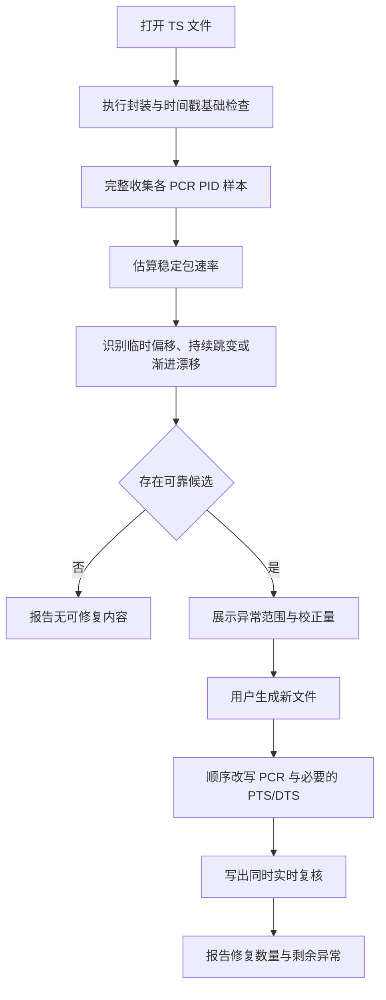

# TS 时间轴修复设计方案

## 1. 目标

TS 时间轴修复用于处理 PCR 临时偏移、持续时钟跳变和渐进漂移等问题，并在必要时同步校正
同一节目中的 PTS/DTS，使输出文件保持连续、可解释的节目时间线。

该工具主要解决以下影响：

- 剪辑或跳转时播放时间线突然变化；
- 码率与异常时间轴出现不合理空白或压缩；
- PCR 与媒体时间戳不再处于一致的时钟关系；
- 多份同源录制因局部时间轴偏移而无法可靠匹配。

时间轴修复不恢复丢失的媒体内容，也不替代连续性、PES 或解码层面的修复。

## 2. 适用范围

### 2.1 当前处理内容

- 标准 188 字节 MPEG-TS 包；
- PCR base 的 33 位回绕；
- PCR 临时偏移；
- 持续时钟跳变；
- 一段时间内逐渐累积后闭合的 PCR 漂移；
- 与 PCR 异常幅度和位置相符的 PTS/DTS；
- 输出过程中的 PCR 连续性实时复核。

### 2.2 非目标

- 不补齐丢失的 TS 包；
- 不移除或隐藏 TEI、连续计数器及 PES 错误；
- 不重建损坏的音视频 ES；
- 不重新编码音视频；
- 不通过解码结果猜测理想时钟；
- 不保证所有 discontinuity 都需要或允许修复。

## 3. 与快速检查的关系

快速检查只维护轻量的 PCR 间隔基线，用于发现值得进一步分析的候选。这样可以保持普通扫描
接近顺序读取速度，也不会因为长文件保存大量 PCR 样本。

当快速检查确认存在候选时，界面提供直达时间轴修复工具的入口。独立工具仍会重新读取文件，
收集完整 PCR 样本并建立正式方案。两阶段设计可以避免以下误导：

- 快速提示不等于最终一定可修复；
- discontinuity 或估算图表横轴不等于 PCR 已损坏；
- 正常起始 PTS/PCR 偏移不应触发修复；
- 传输丢包导致的时间定位不稳定不能靠改写 PCR 消除。

如果快速检查没有确认修复候选，则不开放直达入口。用户仍可从主菜单独立打开时间轴修复
工具，对特定文件执行完整分析。

## 4. 异常识别原则

### 4.1 稳定包速率基线

PCR 同时反映节目时钟和复用流推进关系。分析器从短、正向且未标记 discontinuity 的 PCR
间隔中估算稳定的“每个 TS 包对应时钟增量”，并使用中位关系降低局部抖动的影响。

随后比较每对相邻 PCR 的实际时钟增量与按包位置推算的正常增量。只有偏差超过明确阈值时，
才作为修复边界候选。普通 PCR 抖动、短暂调度变化和起始固定偏移不应进入修复方案。

### 4.2 临时 PCR 偏移

某个边界发生时钟阶跃，稍后又以相反方向回到原时间线，并且两次偏移量在容差内闭合，视为
临时 PCR 偏移。

修复范围只覆盖两个边界之间，区间外 PCR 保持不变。

### 4.3 持续时钟跳变

PCR 在某个边界发生明显阶跃，后续以新的偏移持续推进且没有在合理时间内闭合，视为持续
时钟跳变。

修复从异常边界延续到文件末尾或后续明确边界，使修改后的 PCR 延续异常前的稳定时间线。

### 4.4 渐进漂移

PCR 可能在一段时间内逐步偏离稳定包速率，最后通过一次反向跳变回到原时间线。该模式不能
仅根据最后一次跳变按固定值修复，否则会在漂移起点制造新的不连续。

因此需要回溯累计偏差，找到能够与末端跳变闭合的漂移起点，并在区间内采用平滑变化的校正量。

## 5. 修复方案

修复输出始终生成新文件，不覆盖源文件。每个候选方案应包含：

- PCR PID；
- 异常类型；
- 起止包位置；
- 0-based 时间范围；
- 校正量及其变化方式；
- 是否存在需要同步处理的 PTS/DTS。

## 6. PTS/DTS 同步校正

PCR 与 PTS/DTS 使用同一 90 kHz 时钟域。只改写 PCR 而保留具有相同异常的媒体时间戳，
可能使节目时钟与媒体时间再次分离。

只有当快速基础检查在相同位置发现幅度相符的 PTS/DTS 异常时，方案才将对应媒体时间戳标记
为需要同步校正：

- 临时阶跃区间使用与 PCR 对应的区间校正；
- 渐进漂移区间使用平滑变化的校正；
- 持续跳变使用从边界开始的固定校正；
- 设置 TEI 的包不读取也不改写其中的时间戳。

用户可以关闭 PTS/DTS 同步校正，但界面应明确说明可能产生的时钟关系影响。

## 7. 输出安全边界

时间轴修复只改写能够明确定位的 PCR base 和 PES 时间戳字段，不改变：

- TS 包数量和文件长度；
- PID；
- 连续计数器；
- 媒体 ES 负载；
- PAT、PMT 和业务信息；
- TEI、PES 长度或其他已有错误。

源文件在分析后发生大小变化时，应拒绝继续输出。取消、同步丢失或写入失败时，删除未完成的
目标文件，避免用户误用半成品。

## 8. 实时复核

输出缓冲写盘前同步检查改写后的 PCR 相邻关系，不在输出完成后重新打开文件进行第二次完整
扫描。复核统计包括：

- 修复的异常数量；
- 实际改写的 PCR 数量；
- 实际改写的 PTS/DTS 数量；
- 输出过程中仍检测到的 PCR 错误和警告。

实时复核只证明本次时间轴校正没有留下明显 PCR 不连续，不代表源文件中的传输或媒体错误
已经消失。最终结果仍应结合快速检查报告判断。

## 9. 与多源修复的关系

多源修复可以选择在匹配阶段复用相同的时间轴分析原则，但两种用途不同：

- 独立时间轴修复会生成新的完整校正文件；
- 多源修复只建立虚拟连续时间线，用于跨来源对齐；
- 虚拟归一化不会单独重写输入文件；
- 多源输出会把候选时间偏移换算回参考文件的原始时间线；
- 用户关闭自动校正后，多源修复不再执行额外辅助源时间轴分析。

因此，用户若希望先得到通用的时间轴校正版文件，应使用独立工具；若只希望提高当前多源
修复任务的匹配率，可以保留多源窗口中的自动校正选项。

## 10. 性能与内存

完整分析采用顺序大块读取，只保存稀疏 PCR 样本和有限的异常方案，不缓存完整 TS、PES 或
媒体负载。内存主要与 PCR 样本数量有关，而不是文件字节大小。

独立工具通常需要：

1. 一次基础检查与时间戳事件分析；
2. 一次 PCR 样本收集；
3. 用户确认输出后，再顺序读取一次生成目标文件。

快速检查结果在文件路径、大小和扫描状态仍有效时可以复用基础诊断，但完整 PCR 样本仍需由
独立工具收集。这样以额外顺序读取换取普通快速扫描的低内存和低开销。

## 11. 已知限制

- 仅支持 188 字节 TS 包；
- 不能恢复 PCR 包之间已经丢失的媒体内容；
- 时钟异常过于密集或缺少稳定区间时，可能无法建立可靠基线；
- 显式 discontinuity 会被视为新的合法边界，不一定生成修复方案；
- 缺少有效 PCR 的节目无法使用该工具修复时间线；
- PTS/DTS 异常与 PCR 异常无法可靠关联时，只校正 PCR；
- 输出实时复核不等同于完整重新执行快速检查。

## 12. 验证方案

- 正常 PCR 流不应产生修复候选；
- 正常起始 PTS/PCR 偏移不应触发估算时间轴误报；
- 临时阶跃应只修改闭合区间；
- 持续跳变应从异常边界校正到后续时间线；
- 渐进漂移应使用平滑校正，不能在区间起点制造新跳变；
- 与 PCR 幅度和位置匹配的 PTS/DTS 应按选项同步校正；
- TEI、连续计数器、PES 和媒体错误在输出后仍应如实保留；
- 输出文件大小与源文件保持一致；
- 取消或失败后不保留未完成目标文件；
- 深浅色和三种界面语言应保持状态表达一致。
