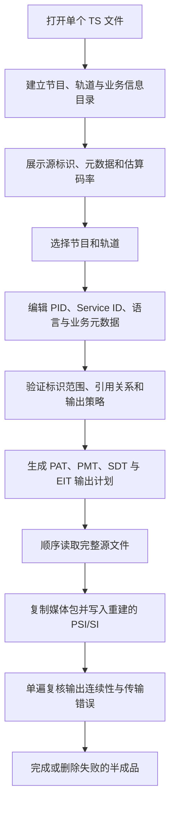

# TS 流编辑器设计方案

## 1. 目标

TS 流编辑器用于在不重新编码音视频的前提下，对单个 MPEG-TS 文件中的节目结构、轨道选择、标识和基础业务元数据进行调整，并输出结构自洽的新 TS 文件。

典型用途包括：

- 删除不需要的视频、音频、字幕或数据轨道；
- 只保留复用流中的部分节目；
- 修改 Service ID、PMT PID、PCR PID 或媒体 PID；
- 修改节目名称、节目提供商和服务类型；
- 修改轨道语言标识或 PMT 中的轨道顺序；
- 筛选与所选节目对应的 EPG；
- 在保持包数量或缩小文件体积之间选择合适的输出方式。

该工具关注 TS 封装结构的编辑，不改变媒体内容本身。

## 2. 与流过滤器的区别

流过滤器以“提取内容”为主要目标，强调快速选择 PID 或将多个服务分别输出为文件。

流编辑器以“重建当前文件的节目结构”为主要目标，除选择保留内容外，还允许修改标识、元数据、语言和轨道顺序，并在相关表之间保持引用一致。

两者共享 PAT、PMT、SDT 等基础构建规则，但用户意图和安全约束不同，不应在界面或文案中混为同一功能。

## 3. 范围与非目标

### 3.1 当前范围

- 标准 188 字节 MPEG-TS；
- 单个输入 TS 文件；
- PAT、PMT 和 DVB SDT 的识别与重建；
- 所选服务的 DVB EIT 筛选；
- TDT/TOT 广播时间保留；
- 节目、轨道、PCR 和 PID 关系调整；
- DVB 服务名称、提供商、服务类型和 ISO 639 语言描述符编辑；
- 紧凑输出或保持源文件包数量；
- 顺序读取和有界内存处理。

### 3.2 非目标

- 不从其他 TS 文件混入新轨道；
- 不转码、重采样或修改编码参数；
- 不修复媒体缺口、花屏或音频损坏；
- 不重新计算 PTS、DTS 或 PCR；
- 不重新复用为严格固定码率；
- 不编辑完整 EPG 事件内容；
- 不尝试保留实际加扰节目的完整条件接收体系。

## 4. 总体流程

准备阶段只读取建立编辑目录所需的数据。真正输出时才顺序读取完整文件，并在同一次写入过程中完成轻量复核。

## 5. 准备阶段与目录

编辑前需要建立以下关系：

- Transport Stream ID；
- Service ID 与 PMT PID；
- 每个节目的 PCR PID；
- 视频、音频、字幕和数据 PID；
- 原始 stream type、节目级描述符和 ES 描述符；
- SDT 中的节目名称、提供商、服务类型及其他描述符；
- 每个 PID 的包数、实际加扰负载计数和估算码率。

探测至少覆盖 20 MiB，避免仅因 PAT、PMT 较早出现就过早停止，从而漏掉周期较长的 SDT 或得到不稳定的码率样本。探测同时设有最大范围，节目表不完整时不会自动扫描完整文件。

码率使用可靠 PCR 区间估算 TS 总传输码率，再按采样范围中的 PID 包占比分摊。该值用于比较轨道占用，包含 TS/PES 封装开销；没有可靠 PCR 时显示不可用。

## 6. 默认值与显式写入

节目名称、提供商和服务类型优先读取源文件已有值。

默认行为遵循：

- 源字段存在时，在界面中展示并默认保持；
- 源字段缺失时，不自动创建空字段或猜测内容；
- 只有用户主动启用写入后，才创建原本不存在的名称或提供商；
- 未编辑的描述符尽量按原始字节保留；
- 无法可靠解析的私有描述符不应因为修改一个已知字段而被无故删除。

这样可以避免“打开并直接输出”意外改变源文件未要求修改的业务信息。

## 7. 节目与轨道选择

至少需要选择一个节目，并且每个输出节目至少保留一条实际 ES 轨道。

轨道列表区分：

- 视频；
- 音频；
- 字幕或图文；
- 数据；
- 独立 PCR 时钟。

取消某条轨道后，输出不仅停止复制对应媒体 PID，还必须从 PMT 中删除该 ES 声明。取消整个节目后，PAT、SDT 和 EIT 也不能继续声明该节目。

## 8. 标识编辑与冲突检查

可编辑标识包括：

- 输出 Service ID；
- 输出 PMT PID；
- 各媒体或数据轨道的输出 PID；
- PCR 所在输出 PID。

输出计划必须保证：

- Service ID 位于合法范围且不重复；
- PID 位于可用范围；
- 不使用 PAT、CAT、NIT、SDT、EIT、TDT/TOT、Null PID 等保留位置；
- 不同源 PID 不映射到同一输出 PID；
- PMT、PCR 和 ES PID 不互相冲突；
- 共享源 PID 在多个节目中保持一致映射。

自动分配 PID 时使用稳定顺序，并跳过已经占用或保留的值。恢复功能则将全部输出标识还原为源值，便于撤销批量调整。

## 9. PAT、PMT 与 SDT 重建

### 9.1 PAT

PAT 只声明最终选择的节目，并写入：

- 原 Transport Stream ID；
- 输出 Service ID；
- 输出 PMT PID；
- 更新后的版本；
- 重新计算的 CRC。

### 9.2 PMT

每个输出节目的 PMT 写入：

- 输出 Service ID；
- 输出 PCR PID；
- 保留的节目级描述符；
- 按用户顺序排列的保留轨道；
- 每条轨道的输出 PID、原 stream type 和更新后的描述符；
- 更新后的版本和 CRC。

### 9.3 SDT

SDT 只描述选中的服务。服务名称、提供商或类型发生变化时，重建 service descriptor；其他合法描述符保持原始内容。

如果源描述符尾部损坏但仍含有私有数据，编辑已知字段时应保留这些原始尾部字节，并把新的合法 service descriptor 放在解析器能够到达的位置。

所有重建 section 都必须遵守 MPEG-TS section 长度上限，超限时拒绝输出，不截断描述符制造表面合法但内容缺失的节目表。

## 10. 语言与轨道顺序

语言编辑通过 PMT ES 描述符中的 ISO 639 language descriptor 完成。

规则包括：

- 使用三字母语言代码；
- 修改已有描述符时保留其余描述符和附加字节；
- 选择“不指定”时只移除语言描述符；
- 原轨道没有语言描述符时，仅在用户选择语言后新增；
- 不因语言修改改变 stream type 或媒体负载。

轨道上移和下移只改变 PMT 中 ES 条目的排列顺序，不重新排列源文件中的媒体 TS 包。播放器通常依据 PMT 顺序决定默认展示顺序，但最终选择行为仍取决于播放器。

## 11. EPG 与广播时间

保留 EPG 时，不能直接复制完整多节目 EIT，否则输出仍可能描述已经删除的服务。

紧凑输出采用以下策略：

- 组装完整 EIT section；
- 只保留当前传输流中被选中的服务；
- Service ID 已修改时同步更新 EIT；
- 修改后重新计算 CRC；
- 按新的连续计数器重新封装为 TS 包。

TDT/TOT 属于复用流级广播时间信息，可以原样保留。

保持精确包数量时，如果同时要求保留 EPG，则必须保留全部原始节目且 Service ID 不变，避免在有限原包槽内进行无法保证一一对应的 EIT 重封装。

## 12. PCR 与轨道删除

PCR 可能位于视频 PID、独立 PID，或用户准备删除的轨道上。

如果承载 PCR 的媒体轨道被删除，仍需保留节目时钟。此时输出只提取原包适配字段中的 PCR，生成不含媒体负载的 PCR-only 包，并让 PMT 的 PCR PID 指向相应输出 PID。

PCR-only 包不消耗媒体连续计数器，不能因为删除视频负载而人为制造新的 CC 跳变。

## 13. 加扰判断

PMT 或 SDT 中的 CA 描述符和 free_CA_mode 可能是残留标记，也可能指向无效或已经不存在的 CA PID。仅凭这些元数据不能断定媒体实际加密。

工具只在所选媒体 PID 中观察到真实加扰负载时拒绝输出。准备阶段用于尽早提示，输出阶段仍会检查完整文件，防止加扰只在文件后段出现。

TEI 表示包内容不可靠，包头中的加扰位和连续计数器也可能已经损坏。因此 TEI 包只计为传输错误，不用于判断加扰，也不作为后续连续性的基线。

当前不尝试重建 CAT、ECM、EMM 或条件接收描述符引用关系，因此实际加扰节目不属于安全编辑范围。

## 14. 输出模式

### 14.1 紧凑输出

紧凑输出只写入所需内容：

- 保留的媒体与数据包；
- 必要 PCR；
- 重建后的 PSI/SI；
- 选择保留的 EPG 和广播时间。

优点是文件更小、节目结构清晰，并允许新表使用不同数量的 TS 包。输出总码率和原固定码率填充特征通常会改变。

### 14.2 保持源文件包数量

该模式要求每个输入 TS 包对应一个输出 TS 包。被移除的内容替换为 Null 包，适合需要保持文件大小、包数量或近似包位置的场景。

重建的 PAT、PMT 和 SDT 只能使用源文件中对应 PID 已有的包槽。如果新 section 需要更多连续包槽，或源文件没有可用于新增 SDT 的位置，则拒绝输出并建议改用紧凑模式。

“保持包数量”不等同于重新计算固定码率，也不会修正源文件时间戳。

## 15. 输出复核与文件安全

输出过程中同步统计写出包的 TEI 和连续性状态，不在完成后重新读取整个输出文件。

复核结果用于区分：

- 输出结构正常；
- 被保留内容中仍带有源文件遗留的传输或连续性错误。

工具不应通过重写错误标志或伪造连续计数器掩盖源文件真实问题。

文件安全规则包括：

- 输出路径不能与源路径相同；
- 取消、同步丢失、加扰检测或写入失败时删除本次半成品；
- 清理失败不能覆盖真正的处理异常；
- 输出完成前不把半成品报告为成功文件。

## 16. 性能与内存设计

### 16.1 准备阶段

- 使用有限范围顺序探测；
- 目录、描述符和码率统计按需启用；
- 码率热路径只维护固定数量的整数状态；
- 不保存逐包码率样本或完整媒体负载。

### 16.2 输出阶段

- 完整文件只顺序读取一次；
- 使用可复用的大块输入和输出缓冲；
- 每个 TS 包通过复用空间解析；
- 只为最终 PSI/SI section、PID 映射和有限组装状态保留内存；
- 不调用音视频解码器；
- 输出复核与写入同遍完成。

因此内存主要与 PID、节目和待组装 section 数量有关，不随输入文件时长线性增长。

## 17. 已知限制

- 仅支持 188 字节 TS 包；
- 不支持跨文件混流；
- 不修复源媒体损坏或时间戳异常；
- 实际加扰节目无法安全编辑；
- 当前以 DVB SDT/EIT 为主要业务信息来源；
- 私有描述符中未知的 PID 或 Service ID 引用无法统一重写；
- 缺少有效 PAT、PMT 或 PCR 时，节目可能无法输出；
- 保持包数量模式受源 PSI/SI 包槽限制；
- 输出码率和 Null 包分布可能与源文件不同；
- 保留轨道中的源连续性错误仍会存在。

## 18. 验证方案

- 未编辑直接输出时，节目、轨道和已知描述符语义应保持一致；
- 删除轨道后，PMT 不再声明对应 PID，媒体包也不进入输出；
- 修改 Service ID、PMT PID、PCR PID 和 ES PID 后，PAT 与 PMT 引用保持一致；
- 修改节目名称、提供商和类型后，SDT 可被常用分析工具正确读取；
- 源字段缺失且用户未启用写入时，不生成额外 service descriptor；
- 修改语言时只改变 ISO 639 描述符，不丢失其他 ES 描述符；
- 删除 PCR 载体轨道后，输出仍具有可用 PCR 且不新增连续性错误；
- 修改 Service ID 并保留 EPG 时，EIT Service ID 与 CRC 正确；
- CA 残留标记但媒体负载清晰的节目允许输出；
- 实际加扰负载在准备阶段或完整输出阶段被拒绝；
- TEI 损坏包不会派生伪加扰或连续性级联错误；
- 保持包数量模式的输出包数与输入一致；
- 取消或失败后不遗留可误用的半成品；
- 多次连续使用后缓冲、文件句柄和窗口订阅能够正常释放。
