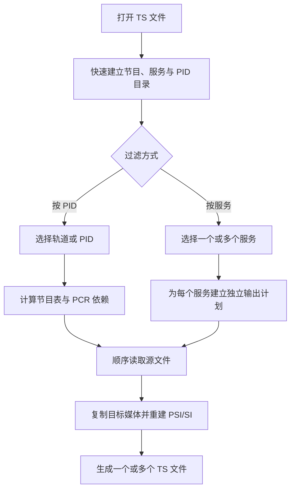

# TS 流过滤设计方案

## 1. 目标

TS 流过滤用于从多节目或多轨道 TS 文件中提取需要的内容，并生成结构自洽、可继续被播放器和分析工具识别的新 TS 文件。

工具提供两种互补的过滤方式：

- **按 PID 过滤**：面向熟悉 TS 结构的用户，可精确选择视频、音频、字幕或数据轨道，也可输出纯音频等自定义组合；
- **按服务过滤**：面向按频道或业务拆分的场景，用户选择一个或多个服务，每个服务输出为独立文件，并默认保留该服务的全部轨道。

两种方式都不是简单地复制某些 PID。输出还必须正确处理 PAT、PMT、PCR 以及必要的业务信息，避免节目表继续声明已经删除的内容。

## 2. 范围与非目标

### 2.1 当前范围

- 188 字节 MPEG-TS；
- 快速识别 PAT、PMT、SDT、节目、服务和轨道；
- 按 PID 选择媒体或数据轨道；
- 按服务生成一个或多个独立输出；
- 自动处理 PAT、PMT 和必要 PCR；
- 按服务重建 SDT，并筛选对应 EIT；
- 保留必要的广播时间信息；
- 顺序读取和有界内存处理。

### 2.2 非目标

- 不转码音视频；
- 不改变编码参数；
- 不重新计算 PTS、DTS；
- 不重新复用为固定码率；
- 不生成源文件中不存在的节目单；
- 不修复源文件已有的媒体缺口；
- 不保证恢复缺失或不完整的节目结构。

## 3. 总体流程

准备阶段只建立选择所需的目录。真正输出时才读取完整文件。

## 4. 为什么不需要预先全量扫描

过滤前需要了解的信息主要来自周期性出现的节目表和业务表：

- Transport Stream ID；
- 节目号与 PMT PID；
- 服务名称、服务商和服务类型；
- 每个节目的媒体、字幕和数据 PID；
- PCR PID；
- 流类型、语言和描述符。

当 PAT、PMT 和所需 SDT 信息已经完整，并在一段数据内保持稳定后，目录扫描即可停止。这样能快速打开长时间录制文件，而不会因为展示选择列表先做一次完整扫描。

准备阶段同时设有最大探测范围。若节目表出现周期过长或文件结构不完整，工具会使用已取得的
目录结束探测，而不是退化为过滤前全量扫描；因此极晚出现的服务可能需要由已知节目号回退展示，
也可能因缺少完整 PMT 而不可提取。

如果 SDT 缺失，按服务模式仍可使用节目号生成回退名称。只出现在 SDT 或 PAT 中、但没有完整 PMT 和轨道数据的服务可以展示出来，但不能提取。

## 5. 按 PID 过滤

### 5.1 显式选择

用户直接选择希望输出的 PID，例如：

- 视频；
- 一条或多条音轨；
- 字幕；
- 私有数据。

### 5.2 自动依赖

为了使输出合法或可播放，工具会自动加入：

- PAT；
- 所属节目的 PMT；
- 必要的 PCR；
- 用户选择保留的业务信息。

“自动依赖”只表示封装结构需要这些内容，不会强制加入未选择的音视频轨道。

### 5.3 节目依赖

选择某个节目的任意轨道后：

1. 该节目成为输出节目；
2. PAT 保留该节目与 PMT PID 的映射；
3. PMT 只声明用户选择的 ES；
4. 保留或提取该节目所需的 PCR；
5. 未选择的媒体 PID 不进入输出。

如果选择的私有 PID 无法归属到已知节目，输出仍会包含合法 PAT，但 PAT 可以不声明节目。

## 6. 按服务过滤

### 6.1 服务目录

按服务模式以 PAT 中的节目号和 SDT 中的服务 ID 建立目录，向用户展示：

- 服务名称；
- 服务 ID；
- 服务商；
- 服务类型；
- PMT PID；
- 该服务包含的轨道；
- 建议的输出文件名。

服务名称缺失时使用服务 ID 作为回退。文件名会移除不适合文件系统的字符，并对重复名称增加序号。用户仍可逐项修改文件名和统一选择输出目录。

### 6.2 输出粒度

每个选中的服务生成一个独立 TS 文件，而不是把多个服务合并到同一输出。

每个服务默认保留：

- 全部视频轨道；
- 全部音频轨道；
- 字幕、图文及相关数据轨道；
- PCR 和必要节目结构；
- 该服务自己的频道信息和节目单。

这种模式适合从一个完整复用流中批量拆分频道。如果需要只保留某条音轨或输出纯音频，应使用按 PID 模式。

### 6.3 单遍多输出

选择多个服务时，源文件只顺序读取一次。每个 TS 包根据 PID 和服务归属分发到对应输出，同时为各输出维护独立的节目表和写入状态。

这样可避免选择多个服务后重复扫描同一个大文件。额外成本主要来自多个目标文件的写入，而不是重复源文件读取。

## 7. PAT 与 PMT 重建

### 7.1 PAT

PAT 根据实际输出节目重新生成，并包含：

- Transport Stream ID；
- 输出节目号；
- 对应 PMT PID；
- 更新后的版本；
- 正确 CRC。

按服务输出时，每个文件的 PAT 只声明该文件对应的一个服务。

### 7.2 PMT

PMT 保留：

- 节目号；
- PCR PID；
- 节目级描述符；
- 实际输出的 ES；
- ES 描述符；
- 更新后的版本和 CRC。

描述符不能随意丢弃，因为私有流类型、语言、字幕格式和注册标识可能依赖描述符才能正确识别。

## 8. PCR 依赖

某些节目在视频 PID 中同时承载视频负载和 PCR。如果按 PID 模式只选择音频，直接删除视频 PID 会同时删除节目时钟。

此时工具只保留该 PID 中实际含 PCR 的适配字段，删除未选择的视频负载，形成 PCR-only 包。这样可以支持纯音频 TS，而不会把视频 ES 一并带入。

按服务模式默认保留完整节目轨道；如果 PCR 使用独立 PID，也会把该 PID 作为服务依赖保留。

## 9. 频道信息与节目单

### 9.1 按 PID 模式

用户可以选择是否保留业务信息。开启后可保留源文件中的典型 DVB SI 或 ATSC PSIP 数据，例如频道名称、服务商、广播时间和节目单。

由于原始 SI 可能同时描述多个节目，按 PID 模式的业务信息以可选原样保留为主，适合用户明确接受完整业务表的场景。

### 9.2 按服务模式

按服务输出不能直接复制完整 SDT 和 EIT，否则拆分后的文件仍会宣告其他服务。

因此每个输出遵循以下规则：

- SDT 只描述目标服务；
- EIT 只保留目标服务、当前传输流对应的节目单 section；
- TDT/TOT 可作为全局时间信息保留；
- 不输出仍会引入其他服务描述的 NIT、BAT 或 RST；
- PAT、PMT 与 SDT 中的服务关系保持一致。

这使频道名称、服务商和目标节目单能够保留，同时避免输出继续表现为原始多服务复用流。

PID `0x0014` 会明确识别为 DVB TDT/TOT 时间表，而不是未知数据 PID。它描述的是复用流级
广播时间，可在需要保留业务信息时原样进入目标输出。

## 10. PSI/SI 写入原则

PAT、PMT、SDT 和 EIT section 都可能跨越多个 TS 包。输出时遵循以下原则：

- 不混用原始 section 与重建 section；
- 完整 section 按 188 字节 TS 包重新分片；
- 正确设置 PUSI 和 pointer field；
- 每个输出独立维护 PSI/SI 连续计数器；
- 使用 stuffing 填满未使用负载空间；
- 保留未修改媒体 PID 的原始包顺序。

按服务过滤 EIT 时，需要先取得完整 section，再根据其中的服务和传输流标识决定是否写入对应输出。

## 11. 输出与文件安全

输出文件名默认由“源文件名 + 服务名称”组成。系统需要处理：

- 服务名称为空；
- 多个服务重名；
- 文件名包含非法字符；
- 用户编辑后产生重复路径；
- 输出路径与源文件冲突；
- 目标文件已经存在。

已有文件不得被静默覆盖。多个输出中的任意一个创建失败时，只清理本次已经创建的不完整文件，不删除冲突前已经存在的用户文件。

取消、同步丢失或写入失败时，也应关闭所有文件并清理未完成输出。

## 12. 输出码率与时间戳

过滤过程不会重新计算 PTS、DTS，也不会为了维持原始总码率补充 Null 包。

因此：

- 保留轨道中的媒体时间戳保持原值；
- 输出通常比源文件更小；
- 瞬时复用码率可能与源文件不同；
- 输出不再保持原始固定码率填充特征。

## 13. 性能与内存设计

### 13.1 准备阶段

- 只扫描足以建立稳定目录的数据；
- 服务元数据解析按需开启；
- 普通快速检查或按 PID 过滤不必保存额外服务目录；
- 不缓存完整媒体或节目单时间线。

### 13.2 输出阶段

- 顺序读取源文件；
- 使用可复用缓冲区；
- 每个输出只保存有限的写入缓冲和 PSI/SI 状态；
- 多服务共享同一次源文件读取；
- 不调用音视频解码器。

内存主要随同时选择的服务数量增长，而不是随源文件时长增长。

## 14. 字符编码

DVB 服务名称和服务商可能使用多种字符集。目录解析需要识别常见 DVB 字符集标识，包括 UTF-8、UTF-16 和常用 ISO-8859 变体。

部分国内设备会直接写入未声明字符集的中文编码。对于这种非标准情况，可以在结果具有明确中文特征时采用兼容回退，但不修改输出中的原始描述符字节。

无法可靠解码的名称应安全回退到服务 ID，不能阻止轨道提取。

## 15. 已知限制

- 仅支持 188 字节 TS 包；
- 不重新编码、重采样或重算时间戳；
- 不保证输出维持原始固定码率；
- 按 PID 保留原始业务信息时，业务表可能描述未输出节目；
- 按服务模式当前以 DVB SDT/EIT 为主要服务信息来源；
- 缺少有效 PAT、PMT 或 PCR 时，服务可能不可提取或兼容性受影响；
- 私有流识别依赖 PMT 描述符是否完整；
- 源文件已有的连续性错误会继续存在于被保留的 PID 中。

## 16. 验证方案

### 16.1 按 PID

- PAT 只声明实际输出节目；
- PMT 只声明用户选择的轨道；
- 纯音频输出仍保留必要 PCR；
- 未选择的视频、音频和字幕 PID 不进入输出；
- 开关业务信息后输出 PID 符合预期。

### 16.2 按服务

- 快速目录能识别多个服务、服务商和轨道；
- 每个输出只包含目标服务的节目号和轨道；
- PAT、PMT、SDT 相互一致；
- EIT 不包含其他服务的节目单；
- 同时选择多个服务时源文件只读取一次；
- 电视服务和纯音频服务都能被常用分析工具识别。

### 16.3 安全与稳定性

- 非法或重复文件名能够被拒绝；
- 已有文件不会被覆盖或误删；
- 取消或错误时不遗留可误用的半成品；
- 多次连续使用后缓冲区和文件句柄能够正常释放。
